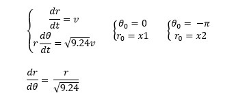
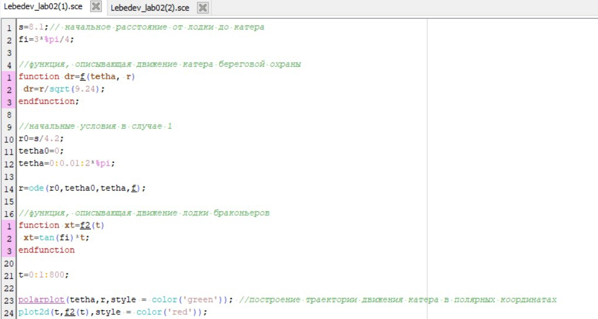
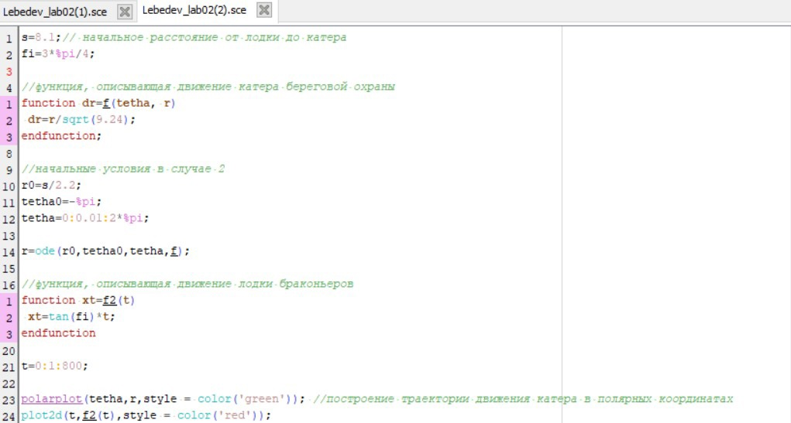
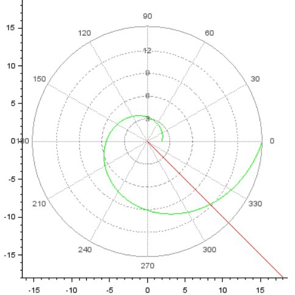
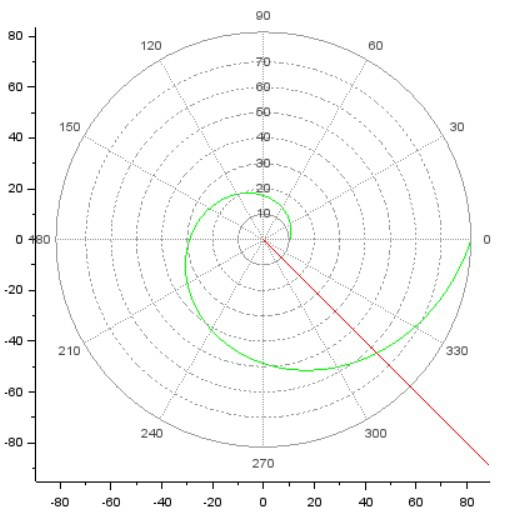

---
# Front matter
title: "Отчет по лабораторной работе №2"
subtitle: "Задача о погоне"
author: "Лебедев Ярослав Борисович"
group: НФИбд-02-19
institute: РУДН, Москва
date: 2022 Feb 18th

# Generic otions
lang: ru-RU
toc-title: "Содержание"

# Bibliography
csl: pandoc/csl/gost-r-7-0-5-2008-numeric.csl

# Pdf output format
toc: true # Table of contents
toc_depth: 2
lof: true # List of figures
fontsize: 12pt
linestretch: 1.5
papersize: a4
documentclass: scrreprt
### Fonts
mainfont: PT Serif
romanfont: PT Serif
sansfont: PT Sans
monofont: PT Mono
mainfontoptions: Ligatures=TeX
romanfontoptions: Ligatures=TeX
sansfontoptions: Ligatures=TeX,Scale=MatchLowercase
monofontoptions: Scale=MatchLowercase,Scale=0.9
## Biblatex
biblatex: true
biblio-style: "gost-numeric"
biblatexoptions:
  - parentracker=true
  - backend=biber
  - hyperref=auto
  - language=auto
  - autolang=other*
  - citestyle=gost-numeric
## Misc options
indent: true
header-includes:
  - \linepenalty=10 # the penalty added to the badness of each line within a paragraph (no associated penalty node) Increasing the value makes tex try to have fewer lines in the paragraph.
  - \interlinepenalty=0 # value of the penalty (node) added after each line of a paragraph.
  - \hyphenpenalty=50 # the penalty for line breaking at an automatically inserted hyphen
  - \exhyphenpenalty=50 # the penalty for line breaking at an explicit hyphen
  - \binoppenalty=700 # the penalty for breaking a line at a binary operator
  - \relpenalty=500 # the penalty for breaking a line at a relation
  - \clubpenalty=150 # extra penalty for breaking after first line of a paragraph
  - \widowpenalty=150 # extra penalty for breaking before last line of a paragraph
  - \displaywidowpenalty=50 # extra penalty for breaking before last line before a display math
  - \brokenpenalty=100 # extra penalty for page breaking after a hyphenated line
  - \predisplaypenalty=10000 # penalty for breaking before a display
  - \postdisplaypenalty=0 # penalty for breaking after a display
  - \floatingpenalty = 20000 # penalty for splitting an insertion (can only be split footnote in standard LaTeX)
  - \raggedbottom # or \flushbottom
  - \usepackage{float} # keep figures where there are in the text
  - \floatplacement{figure}{H} # keep figures where there are in the text
---
# Цель работы
1. Записать уравнение, описывающее движение катера, с начальными условиями для двух случаев (в зависимости от расположения катера относительно лодки в начальный момент времени)
2. Построить траекторию движения катера и лодки для двух случаев
3. Найти точку пересечения траектории катера и лодки

# Задание
Вариант 15. Задача о погоне: На море в тумане катер береговой охраны преследует лодку браконьеров. Через определенный промежуток времени туман рассеивается, и лодка обнаруживается на расстоянии 8,1 км от катера. Затем лодка снова скрывается в тумане и уходит прямолинейно в неизвестном направлении. Известно, что скорость катера в 3,2 раза больше скорости браконьерской лодки. 

# Теоретическое введение
Кривая погони — кривая, представляющая собой решение задачи о «погоне», которая ставится следующим образом. Пусть точка A равномерно движется по некоторой заданной кривой. Требуется найти траекторию равномерного движения точки P такую, что касательная, проведённая к траектории в любой момент движения, проходила бы через соответствующее этому моменту положение точки A [2]. 

# Выполнение лабораторной работы
Примем за t0 = 0, xл0 = 0 - место нахождения лодки браконьеров в момент обнаружения, xk0 = 8,1 - место нахождения катера береговой охраны относительно лодки браконьеров в момент обнаружения лодки [1].

Введем полярные координаты. Считаем, что полюс - это точка обнаружения лодки браконьеров xл0 (θ = xл0 = 0), а полярная ось r проходит через точку нахождения катера береговой охраны (рис.1).

Рис.1. Положение катера и лодки в начальный момент времени

Траектория катера должна быть такой, чтобы и катер, и лодка все время были на одном расстоянии от полюса θ, только в этом случае траектория катера пересечется с траекторией лодки. Поэтому для начала катер береговой охраны должен двигаться некоторое время прямолинейно, пока не окажется на том же расстоянии от полюса, что и лодка браконьеров. После этого катер береговой охраны должен двигаться вокруг полюса удаляясь от него с той же скоростью, что и лодка браконьеров.

Чтобы найти расстояние x (расстояние после которого катер начнет двигаться вокруг полюса), необходимо составить простое уравнение. Пусть через время t катер и лодка окажутся на одном расстоянии x от полюса. За это время лодка пройдет x, а катер k-x (или k+x, в зависимости от начального положения катера относительно полюса). Время, за которое они пройдут это расстояние, вычисляется как x/v или (k-x)/3.2v (во втором случае (k+x)/3.2v). Так как время одно и то же, то эти величины одинаковы. Тогда неизвестное расстояниеx можно найти из следующего уравнения:
в первом случае: x/v = (k-x)/(3.2*v), или во втором: x/v = (k+x)/(3.2*v). Отсюда мы найдем два значения x1 = k/4.2 и x2 = k/2.2, задачу будем решать для двух случаев.

После того, как катер береговой охраны окажется на одном расстоянии от полюса, что и лодка, он должен сменить прямолинейную траекторию и начать двигаться вокруг полюса удаляясь от него со скоростью лодки v. Для этого скорость катера раскладываем на две составляющие: vr - радиальная скорость и vt  - тангенциальная скорость (рис.2). Радиальная скорость - это скорость, с которой катер удаляется от полюса, vr = dr/dt. Нам нужно, чтобы эта скорость была равна скорости лодки, поэтому полагаем dr/dt = v. Тангенциальная скорость – это линейная скорость вращения катера относительно полюса. Она равна произведению угловой скорости dθ/dt на радиус r, vt = r * dθ/dt.

Рис.2. Разложение скорости катера на тангенциальную и радиальную составляющие

Учитывая, что радиальная скорость равна v, из рисунка видно, что по можно выразить катет vt как vt = sqrt(10.24-1)*v = sqrt(9.24)*v. 
Тогда получаем следующее равенство: r * dθ/dt = sqrt(9.24)*v.

Решение исходной задачи сводится к решению системы из двух дифференциальных уравнений с начальными условиями для двух случаев, где можно исключить из полученной системы производную по t и перейти к одному дифференциальному уравнению (рис.3). Начальные условия остаются прежними. Решив это уравнение, мы получим траекторию движения катера в полярных координатах.

Рис.3. Система дифференциальных уравнений. Начальные условия для двух случаев. Дифференциальное уравнение

Для этого напишем код в Scilab для первого случая (рис.4), и для второго (рис.5).

Рис.4. Код для первого случая

Рис.5. Код для второго случая
    
Получим такие результаты: в первом случае пересекутся на расстоянии 11,9 км (рис.6), во втором случае пересекутся на расстоянии 63 км (рис.7).

Рис.6. Результат в первом случае

Рис.7. Результат во втором случае

# Выводы
Записано уравнение, описывающее движение катера, с начальными условиями для двух случаев (в зависимости от расположения катера относительно лодки в начальный момент времени). Построена траектория движения катера и лодки для двух случаев. Найдены точки пересечения траектории катера и лодки для двух случаев

# Список литературы
1. Методические материалы курса
2. Кривая погони (<https://ru.wikipedia.org/wiki/%D0%9A%D1%80%D0%B8%D0%B2%D0%B0%D1%8F_%D0%BF%D0%BE%D0%B3%D0%BE%D0%BD%D0%B8>)
