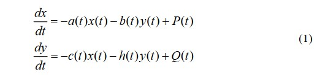

---
# Front matter
title: "Отчет по лабораторной работе №3"
subtitle: "Модель боевых действий"
author: "Лебедев Ярослав Борисович"
group: НФИбд-02-19
institute: РУДН, Москва
date: 2022 Feb 25th

# Generic otions
lang: ru-RU
toc-title: "Содержание"

# Bibliography
csl: pandoc/csl/gost-r-7-0-5-2008-numeric.csl

# Pdf output format
toc: true # Table of contents
toc_depth: 2
lof: true # List of figures
fontsize: 12pt
linestretch: 1.5
papersize: a4
documentclass: scrreprt
### Fonts
mainfont: PT Serif
romanfont: PT Serif
sansfont: PT Sans
monofont: PT Mono
mainfontoptions: Ligatures=TeX
romanfontoptions: Ligatures=TeX
sansfontoptions: Ligatures=TeX,Scale=MatchLowercase
monofontoptions: Scale=MatchLowercase,Scale=0.9
## Biblatex
biblatex: true
biblio-style: "gost-numeric"
biblatexoptions:
  - parentracker=true
  - backend=biber
  - hyperref=auto
  - language=auto
  - autolang=other*
  - citestyle=gost-numeric
## Misc options
indent: true
header-includes:
  - \linepenalty=10 # the penalty added to the badness of each line within a paragraph (no associated penalty node) Increasing the value makes tex try to have fewer lines in the paragraph.
  - \interlinepenalty=0 # value of the penalty (node) added after each line of a paragraph.
  - \hyphenpenalty=50 # the penalty for line breaking at an automatically inserted hyphen
  - \exhyphenpenalty=50 # the penalty for line breaking at an explicit hyphen
  - \binoppenalty=700 # the penalty for breaking a line at a binary operator
  - \relpenalty=500 # the penalty for breaking a line at a relation
  - \clubpenalty=150 # extra penalty for breaking after first line of a paragraph
  - \widowpenalty=150 # extra penalty for breaking before last line of a paragraph
  - \displaywidowpenalty=50 # extra penalty for breaking before last line before a display math
  - \brokenpenalty=100 # extra penalty for page breaking after a hyphenated line
  - \predisplaypenalty=10000 # penalty for breaking before a display
  - \postdisplaypenalty=0 # penalty for breaking after a display
  - \floatingpenalty = 20000 # penalty for splitting an insertion (can only be split footnote in standard LaTeX)
  - \raggedbottom # or \flushbottom
  - \usepackage{float} # keep figures where there are in the text
  - \floatplacement{figure}{H} # keep figures where there are in the text
---

# Цель работы
Постройте графики изменения численности войск армии Х и армии У для двух случаев. Для этого написать программы в OpenModelica

# Задание
Вариант 15. Между страной Х и страной У идет война. Численность состава войск исчисляется от начала войны, и являются временными функциями x(t) и y(t). В начальный момент времени страна Х имеет армию численностью 250 000 человек, а в распоряжении страны У армия численностью в 380 000 человек. Для упрощения модели считаем, что коэффициенты a, b, c, h постоянны. Также считаем P(t) и Q(t) непрерывные функции. Постройте графики изменения численности войск армии Х и армии У для следующих случаев:

1. Модель боевых действий между регулярными войсками

2. Модель ведение боевых действий с участием регулярных войск и партизанских отрядов

# Теоретическое введение
Рассмотрим некоторые простейшие модели боевых действий – модели Ланчестера. В противоборстве могут принимать участие как регулярные войска, так и партизанские отряды. В общем случае главной характеристикой соперников являются численности сторон. Если в какой-то момент времени одна из численностей обращается в нуль, то данная сторона считается проигравшей (при условии, что численность другой стороны в данный момент положительна). Рассмотри три случая ведения боевых действий:
1. Боевые действия между регулярными войсками
2. Боевые действия с участием регулярных войск и партизанских отрядов
3. Боевые действия между партизанскими отрядами 

В первом случае численность регулярных войск определяется тремя факторами:
* скорость уменьшения численности войск из-за причин, не связанных с боевыми действиями (болезни, травмы, дезертирство);
* скорость потерь, обусловленных боевыми действиями противоборствующих сторон (что связанно с качеством стратегии, уровнем вооружения, профессионализмом солдат и т.п.);
* скорость поступления подкрепления (задаётся некоторой функцией от времени).

В этом случае модель боевых действий между регулярными войсками описывается следующим образом (рис.1)

Потери, не связанные с боевыми действиями, описывают члены -a(t)x(t) и -h(t)y(t), члены -b(t)y(t) и -c(t)x(t) отражают потери на поле боя. Коэффициенты b(t) и c(t) указывают на эффективность боевых действий со стороны у и х соответственно, a(t), h(t) - величины, характеризующие степень
влияния различных факторов на потери. Функции P(t), Q(t) учитывают возможность подхода подкрепления к войскам Х и У в течение одного дня.

Во втором случае в борьбу добавляются партизанские отряды. Нерегулярные войска в отличии от постоянной армии менее уязвимы, так как действуют скрытно, в этом случае сопернику приходится действовать неизбирательно, по площадям, занимаемым партизанами. Поэтому считается, что тем потерь партизан, проводящих свои операции в разных местах на некоторой известной территории, пропорционален не только численности армейских соединений, но и численности самих партизан. В результате модель принимает вид (рис.2):

В этой системе все величины имею тот же смысл, что и в системе (1).
Модель ведение боевых действий между партизанскими отрядами с учетом
предположений, сделанном в предыдущем случаем, имеет вид (рис.3):

# Выполнение лабораторной работы
Работу я выполнял в OpenModelica. Для решения поставленной задачи необходимо было написать программы для двух случаев.
Программа для первого случая выглядит следующим образом (рис.4)

Результаты симуляции для первого случая получились следующие(рис.5)

Программа для второго случая выглядит следующим образом (рис.6)

Результаты симуляции для второго случая получились следующие(рис.7)

# Выводы
Написаны программы в OpenModelica для двух случаев ведения боевых действий. Построены графики изменения численности войск армии Х и армии У для двух случаев.

# Список литературы
1. Методические материалы курса
2. Законы Осипова — Ланчестера (URL: https://ru.wikipedia.org/wiki/%D0%97%D0%B0%D0%BA%D0%BE%D0%BD%D1%8B_%D0%9E%D1%81%D0%B8%D0%BF%D0%BE%D0%B2%D0%B0_%E2%80%94_%D0%9B%D0%B0%D0%BD%D1%87%D0%B5%D1%81%D1%82%D0%B5%D1%80%D0%B0)
