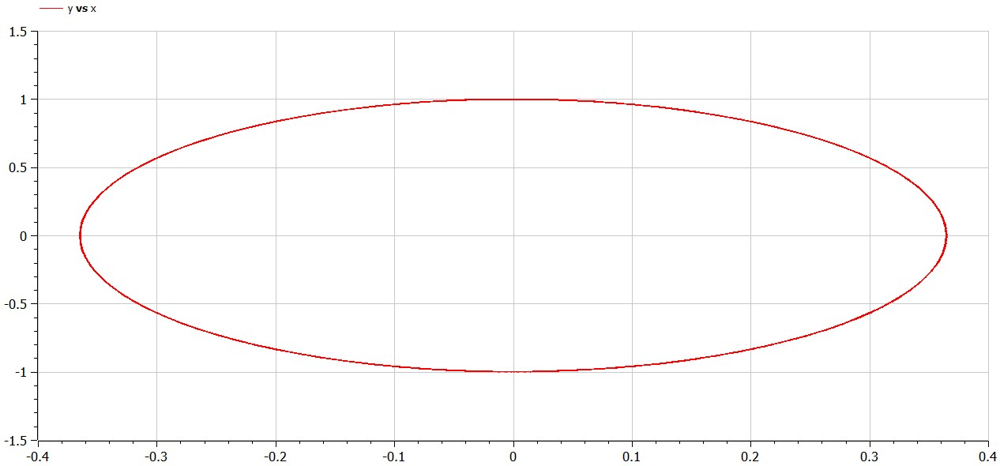
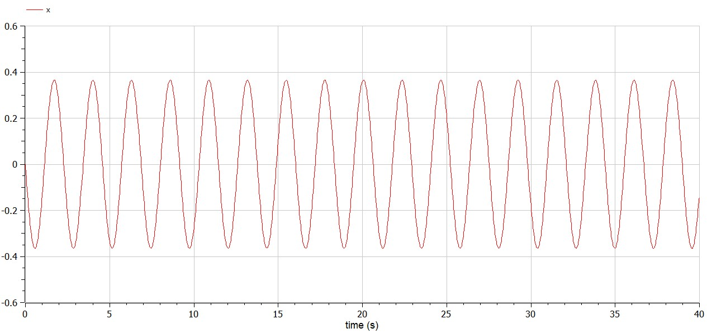
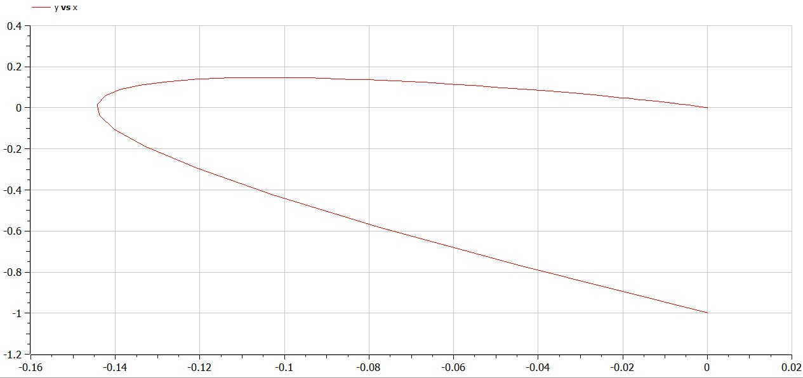
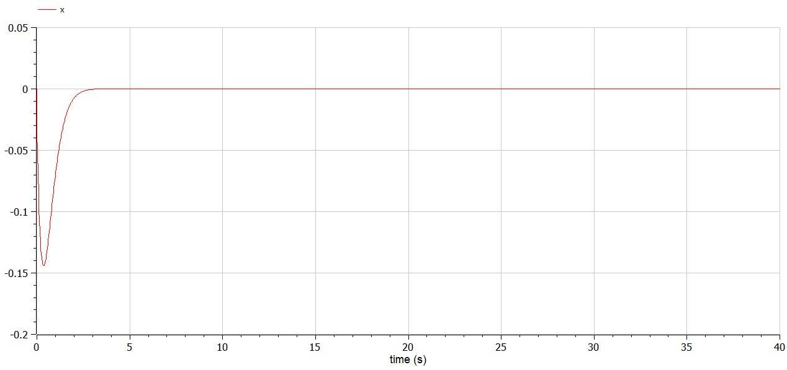
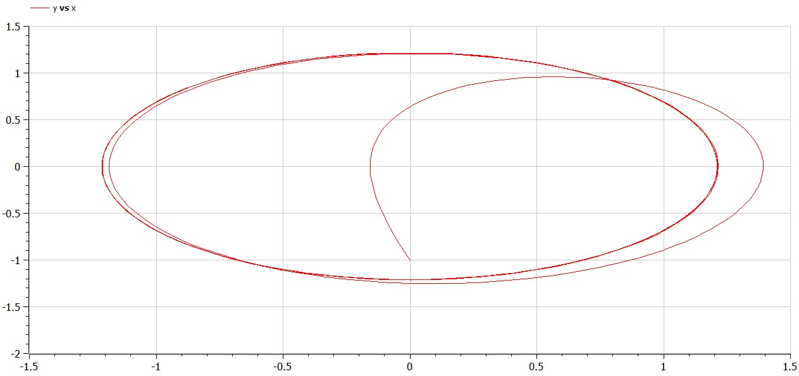
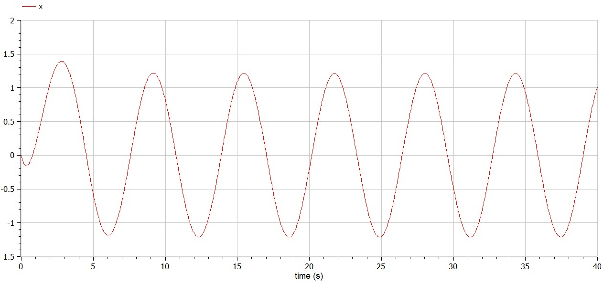

# Лабораторная работа № 4
## Модель гармонических колебаний

выполнил: Лебедев Ярослав Борисович

группа:  НФИбд-02-19

РУДН, Москва

2022 Mar 4th

---

# Прагматика выполнения лабораторной работы
Движение грузика на пружинке, маятника, заряда в электрическом контуре, а также эволюция во времени многих систем в физике, химии, биологии и других науках при определенных предположениях можно описать одним и тем же дифференциальным уравнением, которое в теории колебаний выступает в качестве основной модели. Эта модель называется линейным гармоническим осциллятором.

Чтобы понимать, как система ведёт себя в различных ситуациях, можно построить математические модели такой системы, например, в OpenModelica.

---

# Цель выполнения лабораторной работы:
Построить фазовый портрет гармонического осциллятора и решение уравнения гармонического осциллятора для трёх случаев. Для этого написать программы в OpenModelica.

---

# Задачи выполнения лабораторной работы:
Вариант 15. Постройте фазовый портрет гармонического осциллятора и решение уравнения
гармонического осциллятора для следующих случаев:

1. Колебания гармонического осциллятора без затуханий и без действий внешней силы $$x''+7,5x=0$$
2. Колебания гармонического осциллятора c затуханием и без действий внешней силы $$x''+5x'+7x=0$$
3. Колебания гармонического осциллятора c затуханием и под действием внешней силы $$x''+4x'+2x=5sin(t)$$

На интервале t [0;40] (шаг 0.05) с начальными условиями $$x_0=0, y_0=-1$$.

---

# Результаты выполнения лабораторной работы

---

# Результаты выполнения лабораторной работы

---

# Результаты выполнения лабораторной работы

---

# Результаты выполнения лабораторной работы

---

# Результаты выполнения лабораторной работы

---

# Результаты выполнения лабораторной работы

