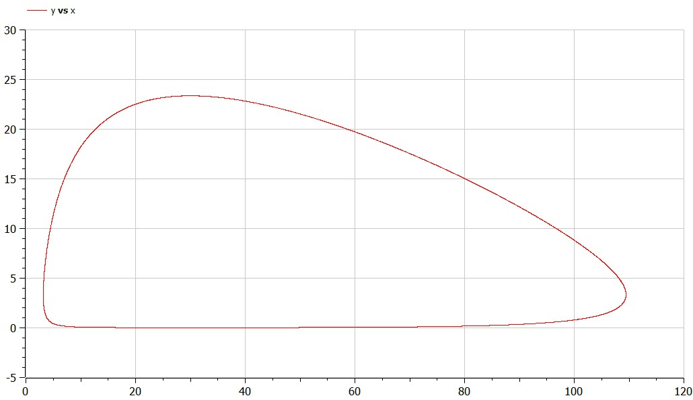
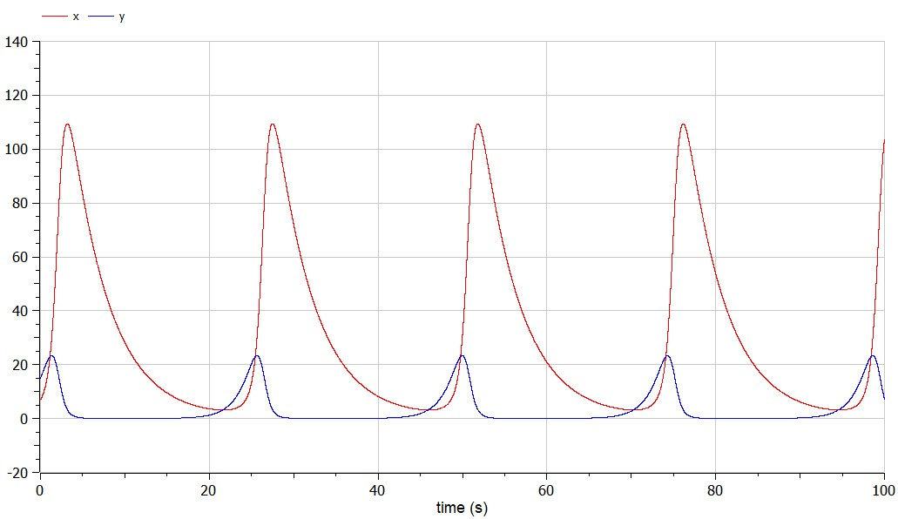
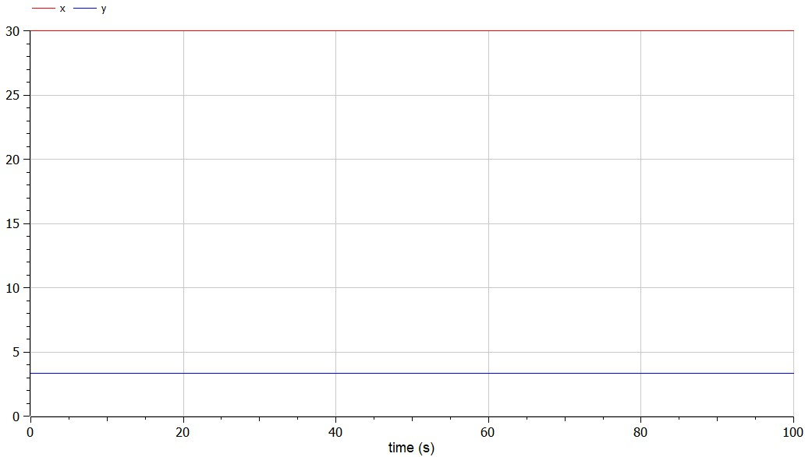

# Лабораторная работа № 5
## Модель хищник-жертва

выполнил: Лебедев Ярослав Борисович

группа:  НФИбд-02-19

РУДН, Москва

2022 Mar 10th

# Прагматика выполнения лабораторной работы

Простейшая модель взаимодействия двух видов типа «хищник — жертва» - модель Лотки-Вольтерры.

Чтобы понимать, как система ведёт себя, можно построить математические модели такой системы, например, в OpenModelica.

# Цель выполнения лабораторной работы:
Построить график зависимости численности хищников от численности жертв, а также графики изменения численности хищников и численности жертв. Найти стационарное состояние системы. Для этого написать программу в OpenModelica.

# Задачи выполнения лабораторной работы:
Вариант 15. Для модели «хищник-жертва»:

$$\dfrac{dx}{dt} = -0.22x(t) + 0.066x(t)y(t)$$
$$\dfrac{dy}{dt} = 0.66y(t) - 0.022x(t)y(t)$$

Постройте график зависимости численности хищников от численности жертв, а также графики изменения численности хищников и численности жертв при следующих начальных условиях: $$x_0=7, y_0=15$$. Найдите стационарное состояние системы.

# Результаты выполнения лабораторной работы

# Результаты выполнения лабораторной работы

# Результаты выполнения лабораторной работы

