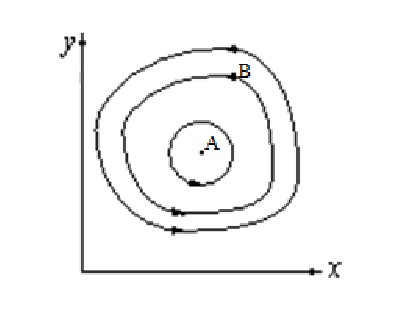
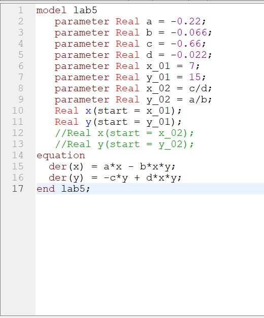
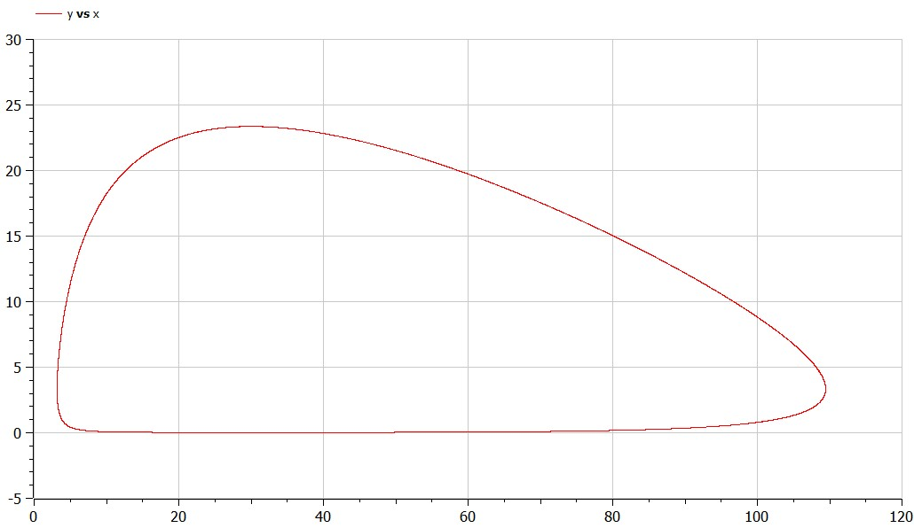
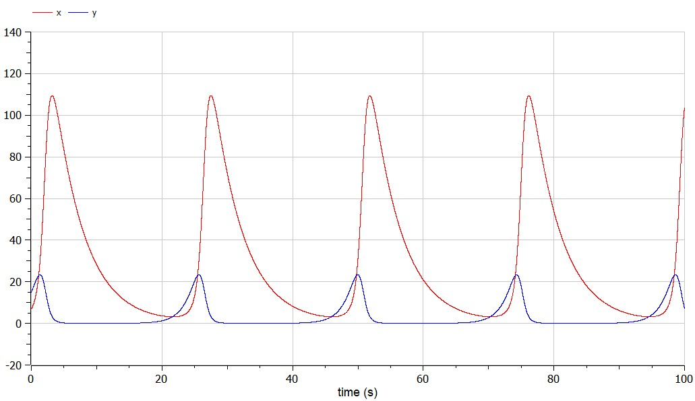
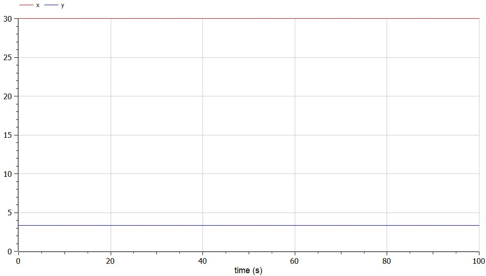

---
# Front matter
title: "Отчет по лабораторной работе №5"
subtitle: "Модель хищник-жертва"
author: "Лебедев Ярослав Борисович"
group: НФИбд-02-19
institute: РУДН, Москва
date: 2022 Mar 10th

# Generic otions
lang: ru-RU
toc-title: "Содержание"

# Bibliography
csl: pandoc/csl/gost-r-7-0-5-2008-numeric.csl

# Pdf output format
toc: true # Table of contents
toc_depth: 2
lof: true # List of figures
fontsize: 12pt
linestretch: 1.5
papersize: a4
documentclass: scrreprt
### Fonts
mainfont: PT Serif
romanfont: PT Serif
sansfont: PT Sans
monofont: PT Mono
mainfontoptions: Ligatures=TeX
romanfontoptions: Ligatures=TeX
sansfontoptions: Ligatures=TeX,Scale=MatchLowercase
monofontoptions: Scale=MatchLowercase,Scale=0.9
## Biblatex
biblatex: true
biblio-style: "gost-numeric"
biblatexoptions:
  - parentracker=true
  - backend=biber
  - hyperref=auto
  - language=auto
  - autolang=other*
  - citestyle=gost-numeric
## Misc options
indent: true
header-includes:
  - \linepenalty=10 # the penalty added to the badness of each line within a paragraph (no associated penalty node) Increasing the value makes tex try to have fewer lines in the paragraph.
  - \interlinepenalty=0 # value of the penalty (node) added after each line of a paragraph.
  - \hyphenpenalty=50 # the penalty for line breaking at an automatically inserted hyphen
  - \exhyphenpenalty=50 # the penalty for line breaking at an explicit hyphen
  - \binoppenalty=700 # the penalty for breaking a line at a binary operator
  - \relpenalty=500 # the penalty for breaking a line at a relation
  - \clubpenalty=150 # extra penalty for breaking after first line of a paragraph
  - \widowpenalty=150 # extra penalty for breaking before last line of a paragraph
  - \displaywidowpenalty=50 # extra penalty for breaking before last line before a display math
  - \brokenpenalty=100 # extra penalty for page breaking after a hyphenated line
  - \predisplaypenalty=10000 # penalty for breaking before a display
  - \postdisplaypenalty=0 # penalty for breaking after a display
  - \floatingpenalty = 20000 # penalty for splitting an insertion (can only be split footnote in standard LaTeX)
  - \raggedbottom # or \flushbottom
  - \usepackage{float} # keep figures where there are in the text
  - \floatplacement{figure}{H} # keep figures where there are in the text
---

# Цель работы
Построить график зависимости численности хищников от численности жертв, а также графики изменения численности хищников и численности жертв. Найти стационарное состояние системы. Для этого написать программу в OpenModelica.

# Задание
Вариант 15. Для модели «хищник-жертва»:

$$\dfrac{dx}{dt} = -0.22x(t) + 0.066x(t)y(t)$$
$$\dfrac{dy}{dt} = 0.66y(t) - 0.022x(t)y(t)$$

Постройте график зависимости численности хищников от численности жертв, а также графики изменения численности хищников и численности жертв при следующих начальных условиях: $$x_0=7, y_0=15$$. Найдите стационарное состояние системы [1].

# Теоретическое введение

Простейшая модель взаимодействия двух видов типа «хищник — жертва» - модель Лотки-Вольтерры [2]. Данная двувидовая модель основывается на следующих предположениях:

1. Численность популяции жертв x и хищников y зависят только от времени (модель не учитывает пространственное распределение популяции на занимаемой территории)
2. В отсутствии взаимодействия численность видов изменяется по модели Мальтуса, при этом число жертв увеличивается, а число хищников падает
3. Естественная смертность жертвы и естественная рождаемость хищника считаются несущественными
4. Эффект насыщения численности обеих популяций не учитывается
5. Скорость роста численности жертв уменьшается пропорционально численности хищников

")

В этой модели x – число жертв, y - число хищников. Коэффициент a описывает скорость естественного прироста числа жертв в отсутствие хищников, с - естественное вымирание хищников, лишенных пищи в виде жертв. Вероятность взаимодействия жертвы и хищника считается пропорциональной как количеству жертв, так и числу самих хищников (xy). Каждый акт взаимодействия уменьшает популяцию жертв, но способствует увеличению популяции хищников (члены -bxy и dxy в правой части уравнения).

Математический анализ этой (жесткой) модели показывает, что имеется стационарное состояние (A на Рис.1), всякое же другое начальное состояние (B) приводит к периодическому колебанию численности как жертв, так и хищников, так что по прошествии некоторого времени система возвращается в состояние B.

Стационарное состояние системы (1) (положение равновесия, не зависящее от времени решение) будет в точке: $$x_0 = \dfrac{c}{d}, y_0 = \dfrac{a}{b}$$. Если начальные значения задать в стационарном состоянии $$x(0)=x_0, y(0)=y_0$$, то в любой момент времени численность популяций изменяться не будет. При малом отклонении от положения равновесия численности как хищника, так и жертвы с течением времени не возвращаются к равновесным значениям, а совершают периодические колебания вокруг стационарной точки. Амплитуда колебаний и их период определяется начальными значениями численностей x(0), y(0). Колебания совершаются в противофазе.

# Выполнение лабораторной работы
Работу я выполнял в OpenModelica. Для решения поставленной задачи необходимо было написать программу (Рис.2).

Результаты выполнения программы: график зависимости численности хищников от численности жертв (Рис.3), графики изменения численности хищников и численности жертв (Рис.4), стационарное состояние системы (Рис.5).

# Выводы
Построен график зависимости численности хищников от численности жертв, а также график изменения численности хищников и численности жертв. Найдено стационарное состояние системы.  Для этого написана программа в OpenModelica.

# Список литературы
1. Методические материалы курса
2. Модель Лотки — Вольтерры, URL: https://ru.wikipedia.org/wiki/%D0%9C%D0%BE%D0%B4%D0%B5%D0%BB%D1%8C_%D0%9B%D0%BE%D1%82%D0%BA%D0%B8_%E2%80%94_%D0%92%D0%BE%D0%BB%D1%8C%D1%82%D0%B5%D1%80%D1%80%D1%8B
