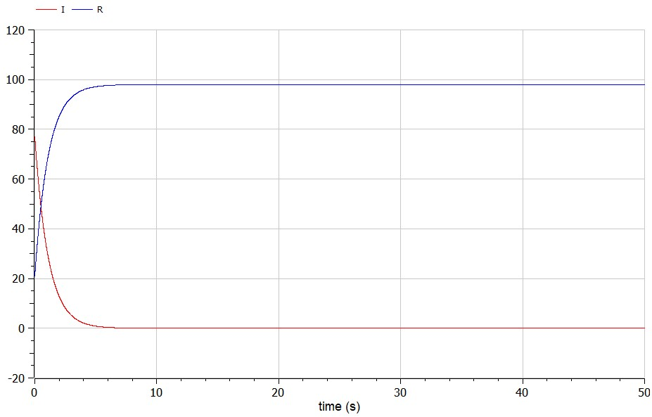
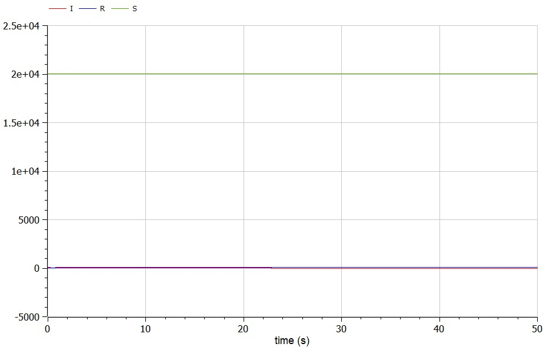

# Лабораторная работа № 6
## Задача об эпидемии

выполнил: Лебедев Ярослав Борисович

группа:  НФИбд-02-19

РУДН, Москва

2022 Mar 16th

# Прагматика выполнения лабораторной работы
")

")

# Прагматика выполнения лабораторной работы

")

Чтобы понимать, как система ведёт себя, можно построить математические модели такой системы, например, в OpenModelica.

# Цель выполнения лабораторной работы:
Построить графики изменения числа особей в каждой из трех групп.
Рассмотрите, как будет протекать эпидемия при двух случаях. Для этого написать программу в OpenModelica.

# Задачи выполнения лабораторной работы:
Вариант 15. На одном острове вспыхнула эпидемия. Известно, что из всех проживающих
на острове (N=20 100) в момент начала эпидемии (t=0) число заболевших людей
(являющихся распространителями инфекции) I(0)=77, А число здоровых людей с
иммунитетом к болезни R(0)=21. Таким образом, число людей восприимчивых к
болезни, но пока здоровых, в начальный момент времени S(0)=N-I(0)- R(0).
Постройте графики изменения числа особей в каждой из трех групп.
Рассмотрите, как будет протекать эпидемия в случае (формула условия):

# Результаты выполнения лабораторной работы

# Результаты выполнения лабораторной работы

# Результаты выполнения лабораторной работы

