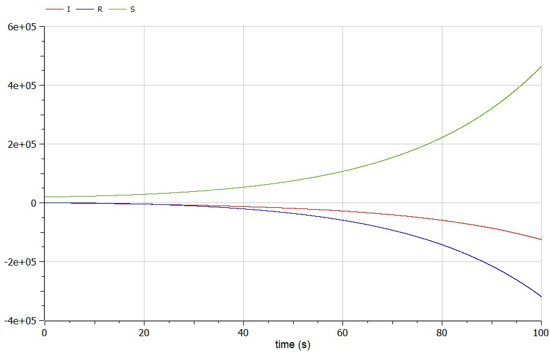

---
# Front matter
title: "Отчет по лабораторной работе №6"
subtitle: "Задача об эпидемии"
author: "Лебедев Ярослав Борисович"
group: НФИбд-02-19
institute: РУДН, Москва
date: 2022 Mar 16th

# Generic otions
lang: ru-RU
toc-title: "Содержание"

# Bibliography
csl: pandoc/csl/gost-r-7-0-5-2008-numeric.csl

# Pdf output format
toc: true # Table of contents
toc_depth: 2
lof: true # List of figures
fontsize: 12pt
linestretch: 1.5
papersize: a4
documentclass: scrreprt
### Fonts
mainfont: PT Serif
romanfont: PT Serif
sansfont: PT Sans
monofont: PT Mono
mainfontoptions: Ligatures=TeX
romanfontoptions: Ligatures=TeX
sansfontoptions: Ligatures=TeX,Scale=MatchLowercase
monofontoptions: Scale=MatchLowercase,Scale=0.9
## Biblatex
biblatex: true
biblio-style: "gost-numeric"
biblatexoptions:
  - parentracker=true
  - backend=biber
  - hyperref=auto
  - language=auto
  - autolang=other*
  - citestyle=gost-numeric
## Misc options
indent: true
header-includes:
  - \linepenalty=10 # the penalty added to the badness of each line within a paragraph (no associated penalty node) Increasing the value makes tex try to have fewer lines in the paragraph.
  - \interlinepenalty=0 # value of the penalty (node) added after each line of a paragraph.
  - \hyphenpenalty=50 # the penalty for line breaking at an automatically inserted hyphen
  - \exhyphenpenalty=50 # the penalty for line breaking at an explicit hyphen
  - \binoppenalty=700 # the penalty for breaking a line at a binary operator
  - \relpenalty=500 # the penalty for breaking a line at a relation
  - \clubpenalty=150 # extra penalty for breaking after first line of a paragraph
  - \widowpenalty=150 # extra penalty for breaking before last line of a paragraph
  - \displaywidowpenalty=50 # extra penalty for breaking before last line before a display math
  - \brokenpenalty=100 # extra penalty for page breaking after a hyphenated line
  - \predisplaypenalty=10000 # penalty for breaking before a display
  - \postdisplaypenalty=0 # penalty for breaking after a display
  - \floatingpenalty = 20000 # penalty for splitting an insertion (can only be split footnote in standard LaTeX)
  - \raggedbottom # or \flushbottom
  - \usepackage{float} # keep figures where there are in the text
  - \floatplacement{figure}{H} # keep figures where there are in the text
---

# Цель работы
Построить графики изменения числа особей в каждой из трех групп.
Рассмотрите, как будет протекать эпидемия при двух случаях. Для этого написать программу в OpenModelica.

# Задание
Вариант 15. На одном острове вспыхнула эпидемия. Известно, что из всех проживающих
на острове (N=20 100) в момент начала эпидемии (t=0) число заболевших людей
(являющихся распространителями инфекции) I(0)=77, А число здоровых людей с
иммунитетом к болезни R(0)=21. Таким образом, число людей восприимчивых к
болезни, но пока здоровых, в начальный момент времени S(0)=N-I(0)- R(0).
Постройте графики изменения числа особей в каждой из трех групп.
Рассмотрите, как будет протекать эпидемия в случае (формула условия):

# Теоретическое введение
Рассмотрим простейшую модель эпидемии [2]. Предположим, что некая
популяция, состоящая из N особей, (считаем, что популяция изолирована)
подразделяется на три группы. Первая группа - это восприимчивые к болезни, но
пока здоровые особи, обозначим их через S(t). Вторая группа – это число
инфицированных особей, которые также при этом являются распространителями
инфекции, обозначим их I(t). А третья группа, обозначающаяся через R(t) – это
здоровые особи с иммунитетом к болезни [1].

До того, как число заболевших не превышает критического значения $I^*$, считаем, что все больные изолированы и не заражают здоровых. Когда I(t)>$I^*$ тогда инфицирование способны заражать восприимчивых к болезни особей.

Таким образом, скорость изменения числа S(t) меняется по следующему
закону (формула 1):

")

Поскольку каждая восприимчивая к болезни особь, которая, в конце концов,
заболевает, сама становится инфекционной, то скорость изменения числа
инфекционных особей представляет разность за единицу времени между
заразившимися и теми, кто уже болеет и лечится, т.е. (формула 2):

")

А скорость изменения выздоравливающих особей (при этом приобретающие
иммунитет к болезни) (формула 3)

")

Постоянные пропорциональности   - это коэффициенты заболеваемости
и выздоровления соответственно.

Для того, чтобы решения соответствующих уравнений определялось
однозначно, необходимо задать начальные условия .Считаем, что на начало
эпидемии в момент времени t=0 нет особей с иммунитетом к болезни R(0)=0, а
число инфицированных и восприимчивых к болезни особей I(0) и S(0)
соответственно. Для анализа картины протекания эпидемии необходимо
рассмотреть два случая (формула условия):

# Выполнение лабораторной работы
Работу я выполнял в OpenModelica. Для решения поставленной задачи необходимо было написать программу (Рис.1).

Результаты выполнения программы при первом условии (Рис.2-3).

Результаты выполнения программы при втором условии (Рис.4).

# Выводы
Построен графики изменения числа особей в каждой из трех групп.
Рассмотрено, как будет протекать эпидемия при двух случаях.  Для этого написана программа в OpenModelica.

# Список литературы
1. Методические материалы курса
2. Задача об эпидемии, URL: https://studizba.com/files/show/doc/12476-1-model-epidemii.html
