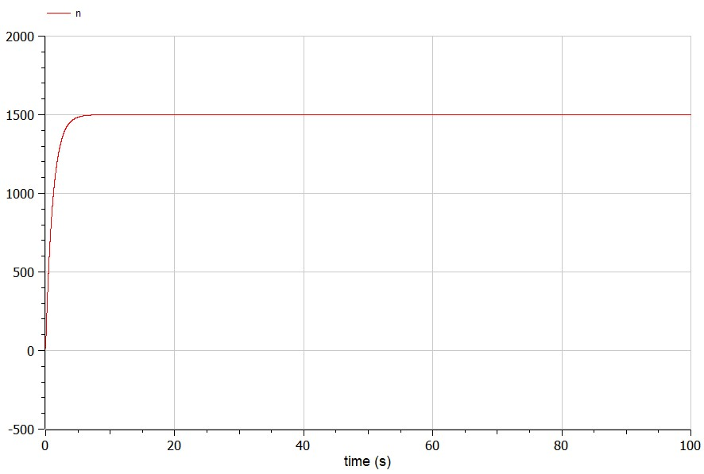

# Лабораторная работа № 7
## Эффективность рекламы

выполнил: Лебедев Ярослав Борисович

группа:  НФИбд-02-19

РУДН, Москва

2022 Mar 22th

# Прагматика выполнения лабораторной работы
")

При a_1(t) >> a_2(t) получается модель типа модели Мальтуса, при a_1(t) << a_2(t) получаем уравнение логистической кривой.

Чтобы понимать, как система ведёт себя, можно построить математические модели такой системы, например, в OpenModelica.

# Цель выполнения лабораторной работы:
Построить графики распространения рекламы для трех случаев. Для
случая 2 определите в какой момент времени скорость распространения рекламы будет
иметь максимальное значение. Для этого написать программу в OpenModelica.

# Задачи выполнения лабораторной работы:
Вариант 15. Постройте график распространения рекламы, математическая модель которой описывается
следующим уравнением (формула условия):

При этом объем аудитории N=1500, в начальный момент о товаре знает 15 человек. Для
случая 2 определите в какой момент времени скорость распространения рекламы будет
иметь максимальное значение.

# Результаты выполнения лабораторной работы

# Результаты выполнения лабораторной работы

# Результаты выполнения лабораторной работы

# Результаты выполнения лабораторной работы

