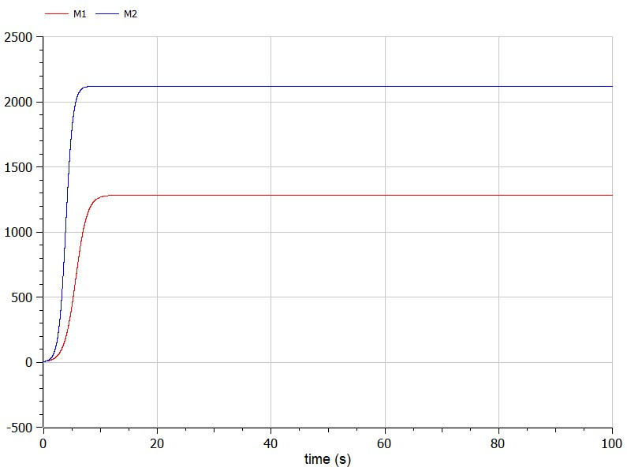
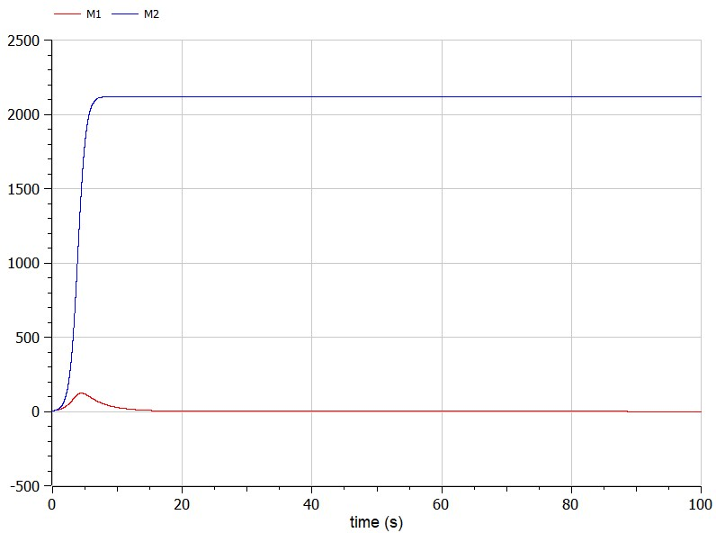

# Лабораторная работа № 8
## Модель конкуренции двух фирм

выполнил: Лебедев Ярослав Борисович

группа:  НФИбд-02-19

РУДН, Москва

2022 Mar 30th

# Прагматика выполнения лабораторной работы
$N$ – число потребителей производимого продукта

$M$ – оборотные средства предприятия

$\tau$ – длительность производственного цикла

$p'$ – рыночная цена товара

$p$– себестоимость продукта, то есть переменные издержки на производство единицы продукции.

$q$ – максимальная потребность одного человека в продукте в единицу времени

$\theta = \frac{t}{c_1}$ - безразмерное время

# Прагматика выполнения лабораторной работы
$$\frac{dM_1}{d\theta} = M_1 - \frac{b}{c_1}M_1M_2 - \frac{a_1}{c_1}M_1^2$$

$$\frac{dM_2}{d\theta} = \frac{c_2}{c_1}M_2 - \frac{b}{c_1}M_1M_2 - \frac{a_2}{c_1}M_2^2$$

где $a_1 = \frac{p_{cr}}{\tau_1^2p_1^2Nq}, a_2 = \frac{p_{cr}}{\tau_2^2p_2^2Nq}, b = \frac{p_{cr}}{\tau_1^2p_1^2\tau_2^2p_2^2Nq}, c_1 = \frac{p_{cr} - p_1}{\tau_1p_1}, c_2 = \frac{p_{cr} - p_2}{\tau_2p_2}$

Чтобы понимать, как система ведёт себя, можно построить математические модели такой системы, например, в OpenModelica.

# Цель выполнения лабораторной работы:
Построить графики изменения оборотных средств фирмы 1 и фирмы 2 без
учета постоянных издержек и с веденной нормировкой для случая 1 и случая 2. Для этого написать программу в OpenModelica.

# Задачи выполнения лабораторной работы:
Вариант 15

Случай 1. 
$$\frac{dM_1}{d\theta} = M_1 - \frac{b}{c_1}M_1M_2 - \frac{a_1}{c_1}M_1^2$$

$$\frac{dM_2}{d\theta} = \frac{c_2}{c_1}M_2 - \frac{b}{c_1}M_1M_2 - \frac{a_2}{c_1}M_2^2$$

Случай 2.
$$\frac{dM_1}{d\theta} = M_1 - (\frac{b}{c_1}+ 0,0006) M_1M_2 - \frac{a_1}{c_1}M_1^2$$

$$\frac{dM_2}{d\theta} = \frac{c_2}{c_1}M_2 - \frac{b}{c_1} M_1M_2 - \frac{a_2}{c_1}M_2^2$$

# Результаты выполнения лабораторной работы

# Результаты выполнения лабораторной работы

