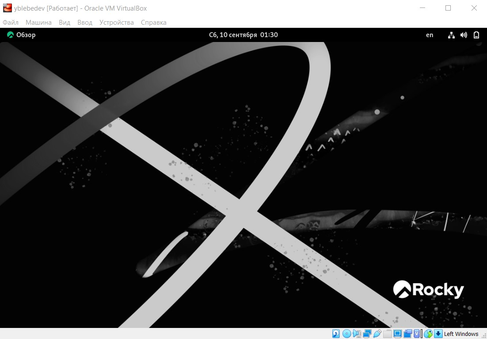
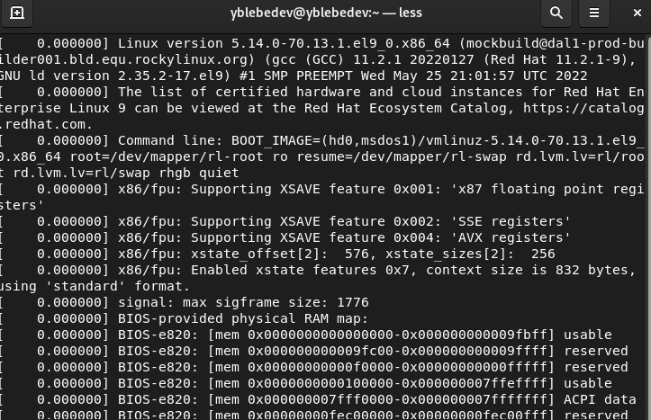
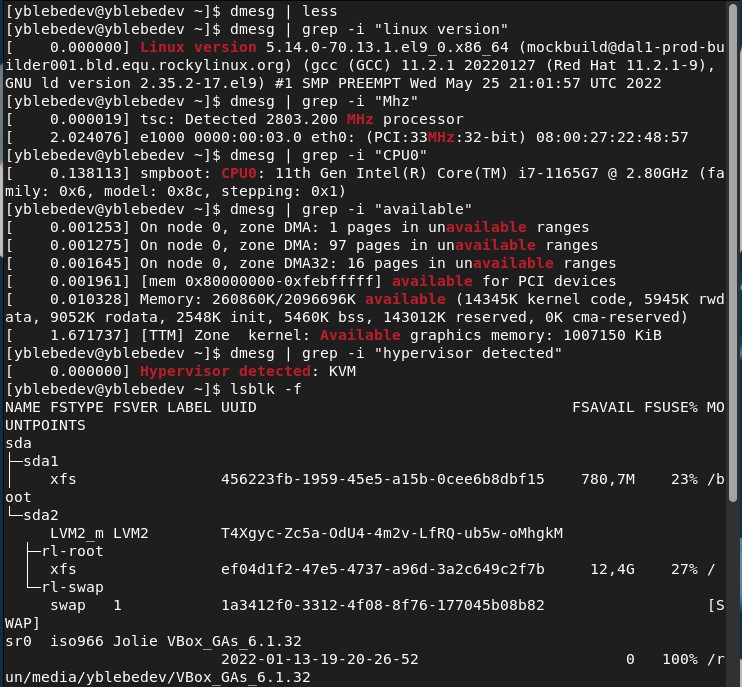
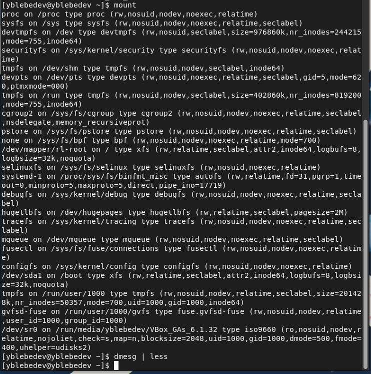

# Лабораторная работа № 1
## Установка и конфигурация
операционной системы на виртуальную машину

выполнил: Лебедев Ярослав Борисович

группа:  НФИбд-02-19

РУДН, Москва

# Цель и задачи выполнения лабораторной работы:
Целью данной работы является приобретение практических навыков
установки операционной системы на виртуальную машину, настройки минимально необходимых для дальнейшей работы сервисов

# Результаты выполнения лабораторной работы

# Результаты выполнения лабораторной работы

# Результаты выполнения лабораторной работы

# Результаты выполнения лабораторной работы

# Выводы
Приобрел практические навыки
установки операционной системы на виртуальную машину, настройки минимально необходимых для дальнейшей работы сервисов

