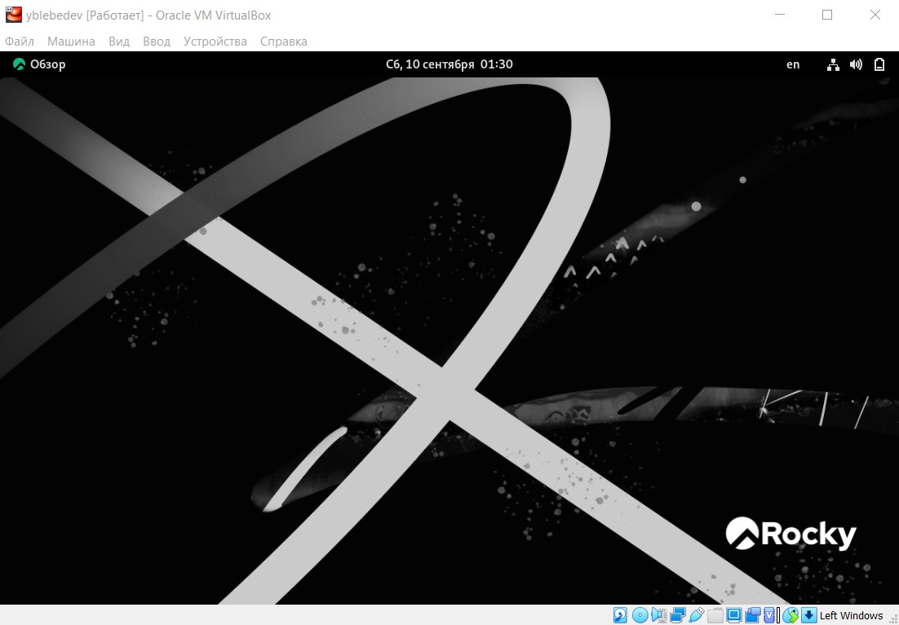

---
# Front matter
title: "Отчет по лабораторной работе №1"
subtitle: "Установка и конфигурация операционной системы на виртуальную машину"
author: "Лебедев Ярослав Борисович"
group: НФИбд-02-19
institute: РУДН, Москва

# Generic otions
lang: ru-RU
toc-title: "Содержание"

# Bibliography
csl: pandoc/csl/gost-r-7-0-5-2008-numeric.csl

# Pdf output format
toc: true # Table of contents
toc_depth: 2
lof: true # List of figures
fontsize: 12pt
linestretch: 1.5
papersize: a4
documentclass: scrreprt
### Fonts
mainfont: PT Serif
romanfont: PT Serif
sansfont: PT Sans
monofont: PT Mono
mainfontoptions: Ligatures=TeX
romanfontoptions: Ligatures=TeX
sansfontoptions: Ligatures=TeX,Scale=MatchLowercase
monofontoptions: Scale=MatchLowercase,Scale=0.9
## Biblatex
biblatex: true
biblio-style: "gost-numeric"
biblatexoptions:
  - parentracker=true
  - backend=biber
  - hyperref=auto
  - language=auto
  - autolang=other*
  - citestyle=gost-numeric
## Misc options
indent: true
header-includes:
  - \linepenalty=10 # the penalty added to the badness of each line within a paragraph (no associated penalty node) Increasing the value makes tex try to have fewer lines in the paragraph.
  - \interlinepenalty=0 # value of the penalty (node) added after each line of a paragraph.
  - \hyphenpenalty=50 # the penalty for line breaking at an automatically inserted hyphen
  - \exhyphenpenalty=50 # the penalty for line breaking at an explicit hyphen
  - \binoppenalty=700 # the penalty for breaking a line at a binary operator
  - \relpenalty=500 # the penalty for breaking a line at a relation
  - \clubpenalty=150 # extra penalty for breaking after first line of a paragraph
  - \widowpenalty=150 # extra penalty for breaking before last line of a paragraph
  - \displaywidowpenalty=50 # extra penalty for breaking before last line before a display math
  - \brokenpenalty=100 # extra penalty for page breaking after a hyphenated line
  - \predisplaypenalty=10000 # penalty for breaking before a display
  - \postdisplaypenalty=0 # penalty for breaking after a display
  - \floatingpenalty = 20000 # penalty for splitting an insertion (can only be split footnote in standard LaTeX)
  - \raggedbottom # or \flushbottom
  - \usepackage{float} # keep figures where there are in the text
  - \floatplacement{figure}{H} # keep figures where there are in the text
---

# Цель работы
Целью данной работы является приобретение практических навыков
установки операционной системы на виртуальную машину, настройки минимально необходимых для дальнейшей работы сервисов [1].

# Выполнение лабораторной работы
Работу выполял с помощью VirtualBox. После создания виртуальной машины, произвел все необходимые настройки системы, корректно перезапустил ее и приступил к работе (Рис.1).

Перешел к выполнению домашнего задания. Дождитесь загрузки графического окружения и откройте терминал. В окне
терминала проанализируйте последовательность загрузки системы, выполнив команду dmesg. Можно просто просмотреть вывод этой команды: dmesg | less (Рис.2).

Можно использовать поиск с помощью grep:
dmesg | grep -i "то, что ищем"

Получите следующую информацию.
1. Версия ядра Linux (Linux version).
2. Частота процессора (Detected Mhz processor).
3. Модель процессора (CPU0).
4. Объем доступной оперативной памяти (Memory available).
5. Тип обнаруженного гипервизора (Hypervisor detected) (на Рис.3 представлено выполнение 1-5)
6. Тип файловой системы корневого раздела (Рис.4). 

Ответил на контрольные вопросы:

1. Какую информацию содержит учётная запись пользователя? - входное имя пользователя, идентификатором пользователя в системе (UID), идентификатор группы (GID ), полное имя, домашний каталог, командная оболочка.

2. Укажите команды терминала и приведите примеры:

– для получения справки по команде; команда --help. Например, Ls --help

– для перемещения по файловой системе; cd. Например, cd ~

– для просмотра содержимого каталога; ls. Например, ls ~

– для определения объёма каталога; du. Например, du ~

– для создания / удаления каталогов / файлов; Для каталогов это mkdir и rm -d соответственно. Например, mkdir papka; rm -d papka. Для файлов это touch и rm сщщтветственно. Например, touch d.doc; rm d.doc.

– для задания определённых прав на файл / каталог; chmod. Например, chmod ugo+w d.doc

– для просмотра истории команд. history

3. Что такое файловая система? Приведите примеры с краткой характеристикой.     Файловая система (ФС) — архитектура хранения данных, которые могут находиться в разделах жесткого диска и ОП. Выдает пользователю доступ к конфигурации ядра. Определяет, какую структуру принимают файлы в каждом из разделов, создает правила для их генерации, а также управляет файлами в соответствии с особенностями каждой конкретной ФС. Например, FS - журналируемая ФС — первая альтернатива для ФС группы Ext. Ее разработали в IBM специально для операционной системы AIX UNIX. Главные плюсы этой системы: стабильность и минимальные требования для работы. Разработчики JFS ставили перед собой цель создать ФС, которая бы эффективно работала на многопроцессорных компьютерах. Кроме того, эта система также относится к журналируемым ФС. Но есть и очевидные недостатки. Если случится непредвиденный сбой в работе системы, ФС может использовать версии файлов, которые уже устарели. Причина заключается в том, что журнал сохраняет только метаданные. ReiserFS - эта ФС разработана под руководством Ганса Райзера и названа в честь него. Подходит исключительно под Linux, чаще всего ее используют в качестве возможной замены Ext3. Главные особенности: увеличенная производительность и более широкие возможности. Изменяющийся размер блока дает пользователю возможность объединять небольшие файлы в один блок, таким образом удается избежать фрагментации и повысить качество работы ФС в целом. Размер разделов можно менять прямо в процессе работы, однако эта ФС может показать нестабильные результаты и потерять данные, например, при отключении энергии.

4. Как посмотреть, какие файловые системы подмонтированы в ОС? Чтобы посмотреть какие файловые системы уже смонтированы в системе можно выполнить команду mount без параметров или выполнить команду df -a.

5. Как удалить зависший процесс? Команды kill , killall и pkill для завершения процесса в Linux.

# Выводы
Приобрел практические навыки
установки операционной системы на виртуальную машину, настройки минимально необходимых для дальнейшей работы сервисов.

# Список литературы
1. Методические материалы курса
