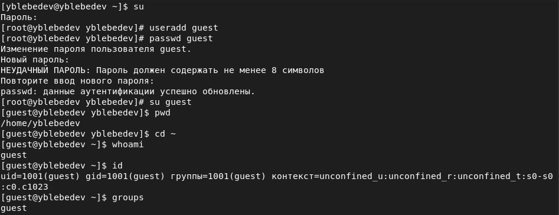
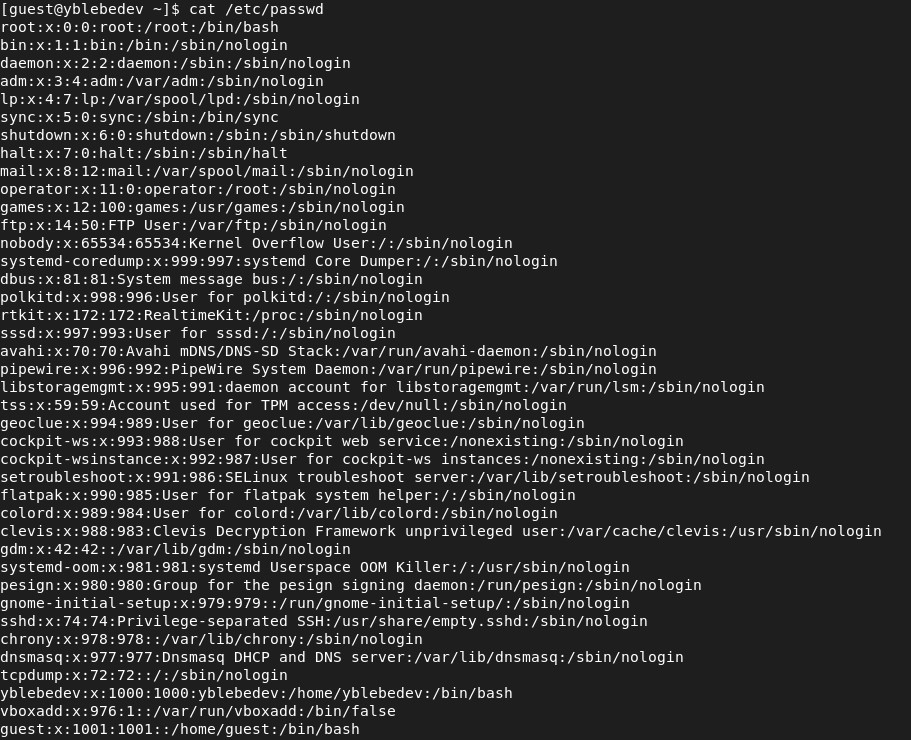
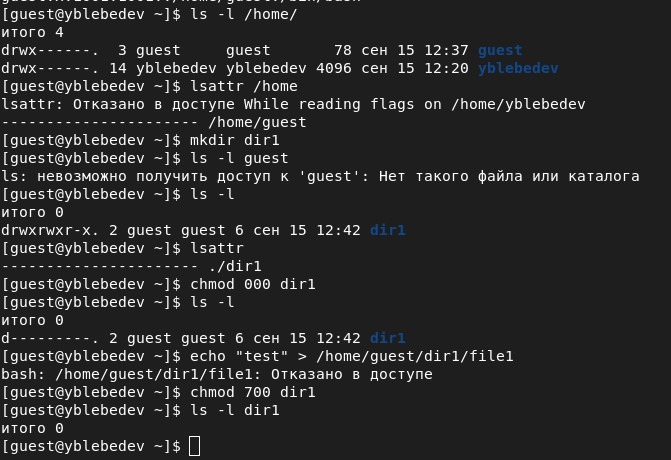
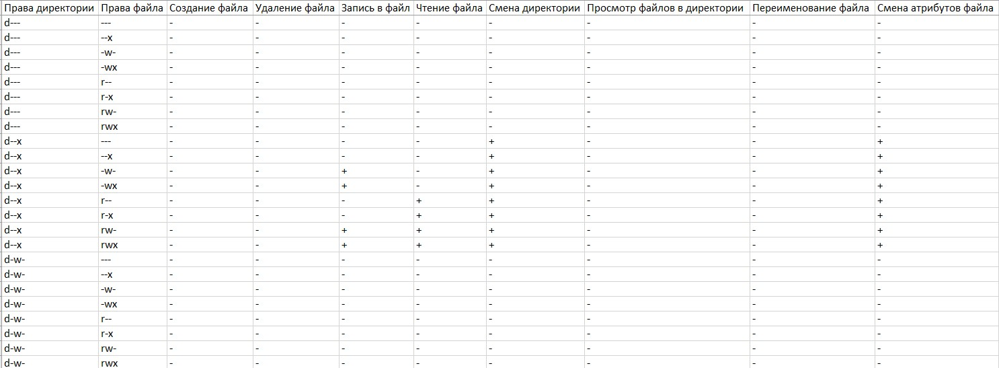
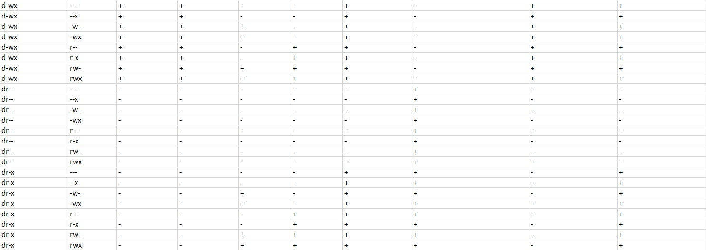
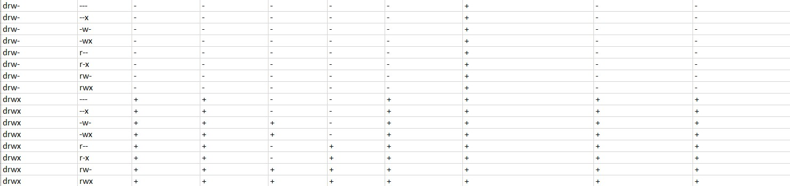
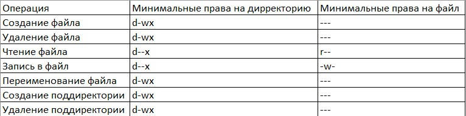

# Лабораторная работа № 2
## Дискреционное разграничение прав в Linux. Основные атрибуты

выполнил: Лебедев Ярослав Борисович

группа:  НФИбд-02-19

РУДН, Москва

# Цель и задачи выполнения лабораторной работы:
Получение практических навыков работы в консоли с атрибутами файлов, закрепление теоретических основ дискреционного разграничения доступа в современных системах с открытым кодом на базе ОС Linux

# Результаты выполнения лабораторной работы

# Результаты выполнения лабораторной работы

# Результаты выполнения лабораторной работы

# Результаты выполнения лабораторной работы

# Результаты выполнения лабораторной работы

# Результаты выполнения лабораторной работы

# Результаты выполнения лабораторной работы

# Выводы
Получил практические навыки работы в консоли с атрибутами файлов, закрепил теоретические основы дискреционного разграничения доступа в современных системах с открытым кодом на базе ОС Linux

