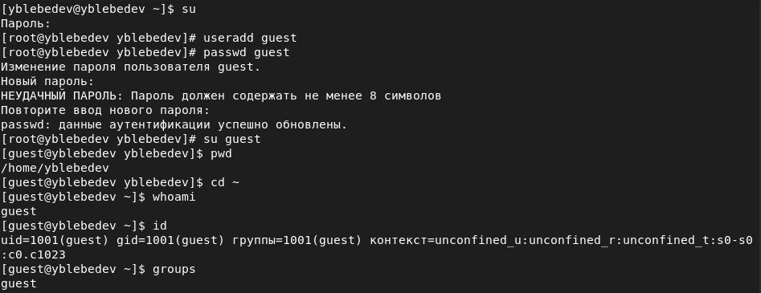
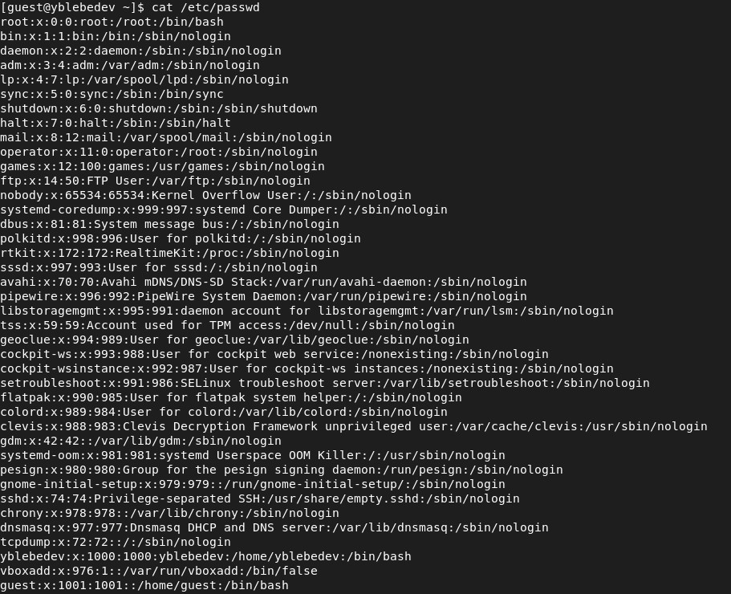
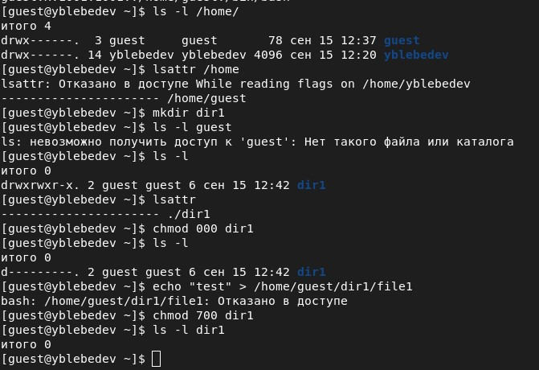

---
# Front matter
title: "Отчет по лабораторной работе №2"
subtitle: "Дискреционное разграничение прав в Linux. Основные атрибуты"
author: "Лебедев Ярослав Борисович"
group: НФИбд-02-19
institute: РУДН, Москва

# Generic otions
lang: ru-RU
toc-title: "Содержание"

# Bibliography
csl: pandoc/csl/gost-r-7-0-5-2008-numeric.csl

# Pdf output format
toc: true # Table of contents
toc_depth: 2
lof: true # List of figures
fontsize: 12pt
linestretch: 1.5
papersize: a4
documentclass: scrreprt
### Fonts
mainfont: PT Serif
romanfont: PT Serif
sansfont: PT Sans
monofont: PT Mono
mainfontoptions: Ligatures=TeX
romanfontoptions: Ligatures=TeX
sansfontoptions: Ligatures=TeX,Scale=MatchLowercase
monofontoptions: Scale=MatchLowercase,Scale=0.9
## Biblatex
biblatex: true
biblio-style: "gost-numeric"
biblatexoptions:
  - parentracker=true
  - backend=biber
  - hyperref=auto
  - language=auto
  - autolang=other*
  - citestyle=gost-numeric
## Misc options
indent: true
header-includes:
  - \linepenalty=10 # the penalty added to the badness of each line within a paragraph (no associated penalty node) Increasing the value makes tex try to have fewer lines in the paragraph.
  - \interlinepenalty=0 # value of the penalty (node) added after each line of a paragraph.
  - \hyphenpenalty=50 # the penalty for line breaking at an automatically inserted hyphen
  - \exhyphenpenalty=50 # the penalty for line breaking at an explicit hyphen
  - \binoppenalty=700 # the penalty for breaking a line at a binary operator
  - \relpenalty=500 # the penalty for breaking a line at a relation
  - \clubpenalty=150 # extra penalty for breaking after first line of a paragraph
  - \widowpenalty=150 # extra penalty for breaking before last line of a paragraph
  - \displaywidowpenalty=50 # extra penalty for breaking before last line before a display math
  - \brokenpenalty=100 # extra penalty for page breaking after a hyphenated line
  - \predisplaypenalty=10000 # penalty for breaking before a display
  - \postdisplaypenalty=0 # penalty for breaking after a display
  - \floatingpenalty = 20000 # penalty for splitting an insertion (can only be split footnote in standard LaTeX)
  - \raggedbottom # or \flushbottom
  - \usepackage{float} # keep figures where there are in the text
  - \floatplacement{figure}{H} # keep figures where there are in the text
---

# Цель работы
Получение практических навыков работы в консоли с атрибутами файлов, закрепление теоретических основ дискреционного разграничения доступа в современных системах с открытым кодом на базе ОС Linux [1].

# Выполнение лабораторной работы
Работу выполял с помощью VirtualBox. 

1. В установленной при выполнении предыдущей лабораторной работы
операционной системе создайте учётную запись пользователя guest (использую учётную запись администратора):
useradd guest (Рис.1)

2. Задайте пароль для пользователя guest (использую учётную запись администратора):
passwd guest (Рис.1)

3. Войдите в систему от имени пользователя guest (Рис.1).

4. Определите директорию, в которой вы находитесь, командой pwd. Сравните её с приглашением командной строки. Определите, является ли она вашей домашней директорией? Если нет, зайдите в домашнюю директорию (Рис.1).

5. Уточните имя вашего пользователя командой whoami (Рис.1).

6. Уточните имя вашего пользователя, его группу, а также группы, куда входит пользователь, командой id. Выведенные значения uid, gidи др. запомните. Сравните вывод idс выводом команды groups (Рис.1).

7. Сравните полученную информацию об имени пользователя с данными,
выводимыми в приглашении командной строки. Данные guest и дамашней дирректории различаются.

8. Просмотрите файл /etc/passwd командой cat /etc/passwd. Найдите в нём свою учётную запись. Определите uid пользователя.
Определите gid пользователя. Сравните найденные значения с полученными в предыдущих пунктах.
Замечание: в случае, когда вывод команды не умещается на одном
экране монитора, используйте прокрутку вверх–вниз (удерживая клавишу shift, нажимайте page up и page down) либо программу grep в
качестве фильтра для вывода только строк, содержащих определённые
буквенные сочетания:
cat /etc/passwd | grep guest  (Рис.2).

9. Определите существующие в системе директории командой
ls -l /home/
Удалось ли вам получить список поддиректорий директории /home? Какие права установлены на директориях? Удалось, установлены полные права для пользователя  (Рис.3).

10. Проверьте, какие расширенные атрибуты установлены на поддиректориях, находящихся в директории /home, командой  (Рис.3):
lsattr /home
Удалось ли вам увидеть расширенные атрибуты директории?
Удалось ли вам увидеть расширенные атрибуты директорий других
пользователей? Удалось, но для других пользователей у меня нет доступа к просмотру.

11. Создайте в домашней директории поддиректорию dir1 командой
mkdir dir1
Определите командами ls -l и lsattr, какие права доступа и расширенные атрибуты были выставлены на директорию dir1  (Рис.3).

12. Снимите с директории dir1 все атрибуты  (Рис.3) командой
chmod 000 dir1
и проверьте с её помощью правильность выполнения команды
ls -l

13. Попытайтесь создать в директории dir1 файл file1 командой  (Рис.3)
echo "test" > /home/guest/dir1/file1
Объясните, почему вы получили отказ в выполнении операции по созданию файла?
Оцените, как сообщение об ошибке отразилось на создании файла? Проверьте командой
ls -l /home/guest/dir1
действительно ли файл file1 не находится внутри директории dir1.

Получен отказ, так как мы сняли все права доступа на дирректорию.

14. Заполните таблицу «Установленные права и разрешённые действия»
(Рис. 4-6), выполняя действия от имени владельца директории (файлов), определив опытным путём, какие операции разрешены, а какие нет.
Если операция разрешена, занесите в таблицу знак «+», если не разрешена, знак «-».
Замечание 1: при заполнении табл. 2.1 рассматриваются не все атрибуты файлов и директорий, а лишь «первые три»: г, w, х, для «владельца».
Остальные атрибуты также важны (особенно при использовании доступа от имени разных пользователей, входящих в те или иные группы).
Проверка всех атрибутов при всех условиях значительно увеличила бы
таблицу: так 9 атрибутов на директорию и 9 атрибутов на файл дают
218 строк без учёта дополнительных атрибутов, плюс таблица была бы
расширена по количеству столбцов, так как все приведённые операции
необходимо было бы повторить ещё как минимум для двух пользователей: входящего в группу владельца файла и не входящего в неё.
После полного заполнения табл. 2.1 и анализа полученных данных нам
удалось бы выяснить, что заполнение её в таком виде излишне. Можно разделить большую таблицу на несколько малых независимых таблиц.
В данном примере предлагается рассмотреть 3+3атрибута, т.е. 26 = 64
варианта.
Замечание 2: в ряде действий при выполнении команды удаления файла
вы можете столкнуться с вопросом: «удалить защищённый от записи пустой обычный файл dir1/file1?» Обратите внимание, что наличие этого
вопроса не позволяет сделать правильный вывод о том, что файл можно удалить. В ряде случаев, при ответе «y» (да) на указанный вопрос,
возможно получить другое сообщение: «невозможно удалить dirl /file1:
Отказано в доступе».

15. На основании заполненной таблицы определите те или иные минимально необходимые права для выполнения операций внутри директории
dir1, заполните табл. 2.2 (Рис. 7).

# Выводы
Получил практические навыки работы в консоли с атрибутами файлов, закрепил теоретические основы дискреционного разграничения доступа в современных системах с открытым кодом на базе ОС Linux.

# Список литературы
1. Методические материалы курса
