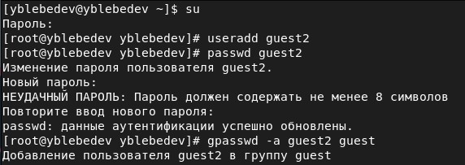
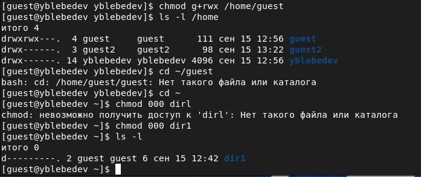
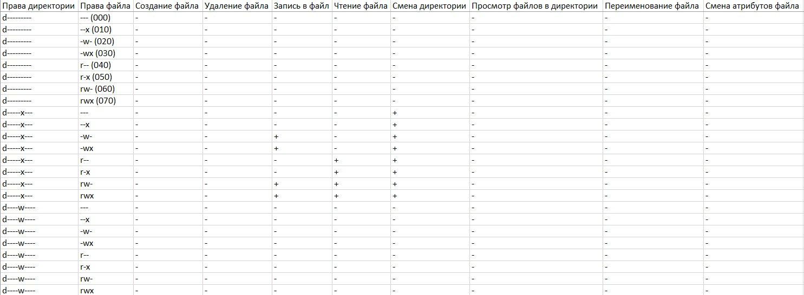
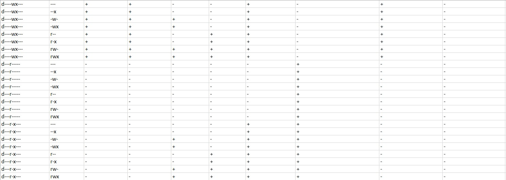
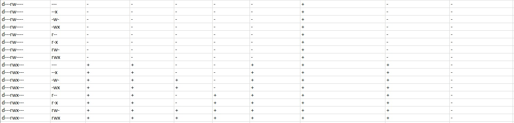

# Лабораторная работа № 3
## Дискреционное разграничение прав в Linux. Два пользователя

выполнил: Лебедев Ярослав Борисович

группа:  НФИбд-02-19

РУДН, Москва

# Цель и задачи выполнения лабораторной работы:
Получение практических навыков работы в консоли с атрибутами файлов для групп пользователей

# Результаты выполнения лабораторной работы

# Результаты выполнения лабораторной работы
.jpg)

.jpg)

# Результаты выполнения лабораторной работы
.jpg)

.jpg)

# Результаты выполнения лабораторной работы
.jpg)

# Результаты выполнения лабораторной работы
.jpg)

# Результаты выполнения лабораторной работы

# Результаты выполнения лабораторной работы

# Результаты выполнения лабораторной работы

# Результаты выполнения лабораторной работы

# Результаты выполнения лабораторной работы

# Выводы
Получил практические навыки работы в консоли с атрибутами файлов для групп пользователей

