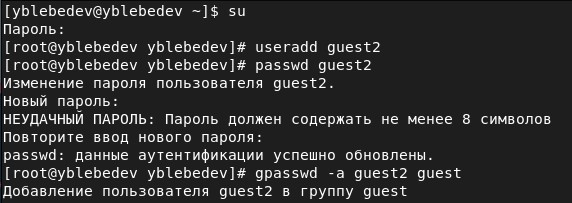
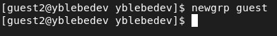
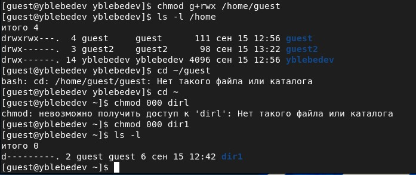
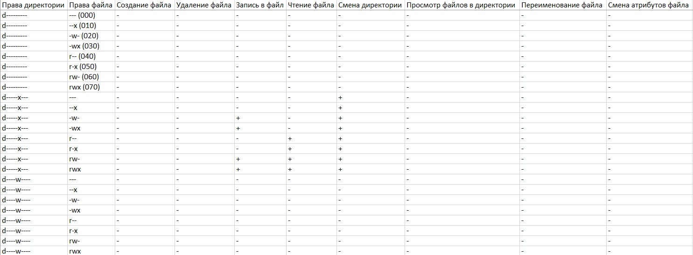

---
# Front matter
title: "Отчет по лабораторной работе №3"
subtitle: "Дискреционное разграничение прав в Linux. Два пользователя"
author: "Лебедев Ярослав Борисович"
group: НФИбд-02-19
institute: РУДН, Москва

# Generic otions
lang: ru-RU
toc-title: "Содержание"

# Bibliography
csl: pandoc/csl/gost-r-7-0-5-2008-numeric.csl

# Pdf output format
toc: true # Table of contents
toc_depth: 2
lof: true # List of figures
fontsize: 12pt
linestretch: 1.5
papersize: a4
documentclass: scrreprt
### Fonts
mainfont: PT Serif
romanfont: PT Serif
sansfont: PT Sans
monofont: PT Mono
mainfontoptions: Ligatures=TeX
romanfontoptions: Ligatures=TeX
sansfontoptions: Ligatures=TeX,Scale=MatchLowercase
monofontoptions: Scale=MatchLowercase,Scale=0.9
## Biblatex
biblatex: true
biblio-style: "gost-numeric"
biblatexoptions:
  - parentracker=true
  - backend=biber
  - hyperref=auto
  - language=auto
  - autolang=other*
  - citestyle=gost-numeric
## Misc options
indent: true
header-includes:
  - \linepenalty=10 # the penalty added to the badness of each line within a paragraph (no associated penalty node) Increasing the value makes tex try to have fewer lines in the paragraph.
  - \interlinepenalty=0 # value of the penalty (node) added after each line of a paragraph.
  - \hyphenpenalty=50 # the penalty for line breaking at an automatically inserted hyphen
  - \exhyphenpenalty=50 # the penalty for line breaking at an explicit hyphen
  - \binoppenalty=700 # the penalty for breaking a line at a binary operator
  - \relpenalty=500 # the penalty for breaking a line at a relation
  - \clubpenalty=150 # extra penalty for breaking after first line of a paragraph
  - \widowpenalty=150 # extra penalty for breaking before last line of a paragraph
  - \displaywidowpenalty=50 # extra penalty for breaking before last line before a display math
  - \brokenpenalty=100 # extra penalty for page breaking after a hyphenated line
  - \predisplaypenalty=10000 # penalty for breaking before a display
  - \postdisplaypenalty=0 # penalty for breaking after a display
  - \floatingpenalty = 20000 # penalty for splitting an insertion (can only be split footnote in standard LaTeX)
  - \raggedbottom # or \flushbottom
  - \usepackage{float} # keep figures where there are in the text
  - \floatplacement{figure}{H} # keep figures where there are in the text
---

# Цель работы
Получение практических навыков работы в консоли с атрибутами файлов для групп пользователей [1].

# Выполнение лабораторной работы
Работу выполял с помощью VirtualBox. 

1. В установленной операционной системе создайте учётную запись пользователя guest (использую учётную запись администратора):
useradd guest

2. Задайте пароль для пользователя guest (использую учётную запись администратора):
passwd guest

Пункты 1-2 я выполнил в лабораторной работе 2.

3. Аналогично создайте второго пользователя guest2 (Рис.1).

4. Добавьте пользователя guest2 в группу guest:
gpasswd -a guest2 guest (Рис.1).

5. Осуществите вход в систему от двух пользователей на двух разных консолях: guest на первой консоли и guest2 на второй консоли (Рис.2-3).

6. Для обоих пользователей командой pwd определите директорию, в которой вы находитесь. Сравните её с приглашениями командной строки (Рис.2-3). Дирректория и guest не совпадают.

.jpg)

.jpg)

7. Уточните имя вашего пользователя, его группу, кто входит в неё
и к каким группам принадлежит он сам. Определите командами
groups guest и groups guest2, в какие группы входят пользователи guest и guest2. Сравните вывод команды groups с выводом команд
id -Gnи id -G (Рис. 4-5). Выводы команд совпадают.

.jpg)

.jpg)

8. Сравните полученную информацию с содержимым файла /etc/group.
Просмотрите файл командой
cat /etc/group (Рис. 6-7).

.jpg)

.jpg)

9. От имени пользователя guest2 выполните регистрацию пользователя
guest2 в группе guest командой
newgrp guest (Рис. 8).

10. От имени пользователя guest измените права директории /home/guest,
разрешив все действия для пользователей группы:
chmod g+rwx /home/guest (Рис. 9).

11. От имени пользователя guest снимите с директории /home/guest/dir1
все атрибуты командой
chmod 000 dir1 и проверьте правильность снятия атрибутов (Рис. 9).

Меняя атрибуты у директории dir1 и файла file1 от имени пользователя guest и делая проверку от пользователя guest2, заполните табл. 3.1 (Рис. 10-12),
определив опытным путём, какие операции разрешены, а какие нет. Если операция разрешена, занесите в таблицу знак «+», если не разрешена,
знак «-».

Сравните табл. 2.1 (из лабораторной работы № 2) и табл. 3.1. Таблицы отличаются тем, что для пользователей групп не позволено менять права на файлы в дирректории.

На основании заполненной таблицы определите те или иные минимально необходимые права для выполнения пользователем guest2 операций
внутри директории dir1 и заполните табл. 3.2 (Рис. 13).

# Выводы
Получил практические навыки работы в консоли с атрибутами файлов для групп пользователей.

# Список литературы
1. Методические материалы курса
