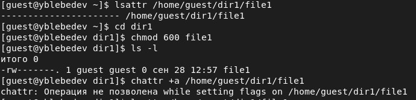
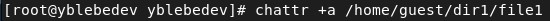
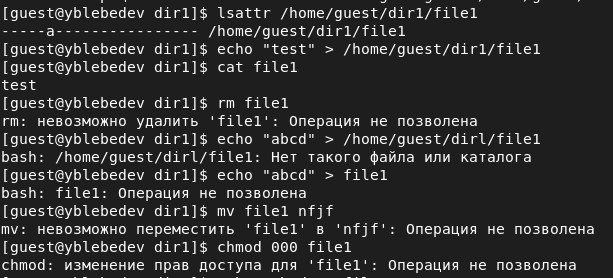
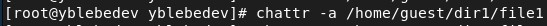
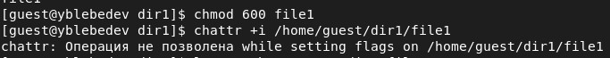

# Лабораторная работа № 4
## Дискреционное разграничение прав в Linux. Расширенные атрибуты

выполнил: Лебедев Ярослав Борисович

группа:  НФИбд-02-19

РУДН, Москва

# Цель и задачи выполнения лабораторной работы:
Получение практических навыков работы в консоли с расширенными атрибутами файлов

# Результаты выполнения лабораторной работы

# Результаты выполнения лабораторной работы

# Результаты выполнения лабораторной работы

# Результаты выполнения лабораторной работы

# Результаты выполнения лабораторной работы

# Выводы
Получил практические навыки работы в консоли с расширенными
атрибутами файлов
