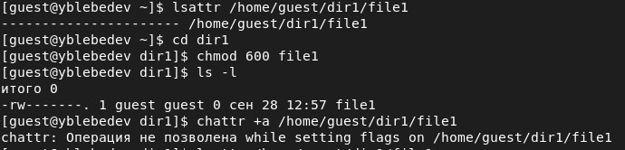
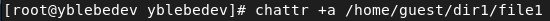

---
# Front matter
title: "Отчет по лабораторной работе №4"
subtitle: "Дискреционное разграничение прав в Linux. Расширенные атрибуты"
author: "Лебедев Ярослав Борисович"
group: НФИбд-02-19
institute: РУДН, Москва

# Generic otions
lang: ru-RU
toc-title: "Содержание"

# Bibliography
csl: pandoc/csl/gost-r-7-0-5-2008-numeric.csl

# Pdf output format
toc: true # Table of contents
toc_depth: 2
lof: true # List of figures
fontsize: 12pt
linestretch: 1.5
papersize: a4
documentclass: scrreprt
### Fonts
mainfont: PT Serif
romanfont: PT Serif
sansfont: PT Sans
monofont: PT Mono
mainfontoptions: Ligatures=TeX
romanfontoptions: Ligatures=TeX
sansfontoptions: Ligatures=TeX,Scale=MatchLowercase
monofontoptions: Scale=MatchLowercase,Scale=0.9
## Biblatex
biblatex: true
biblio-style: "gost-numeric"
biblatexoptions:
  - parentracker=true
  - backend=biber
  - hyperref=auto
  - language=auto
  - autolang=other*
  - citestyle=gost-numeric
## Misc options
indent: true
header-includes:
  - \linepenalty=10 # the penalty added to the badness of each line within a paragraph (no associated penalty node) Increasing the value makes tex try to have fewer lines in the paragraph.
  - \interlinepenalty=0 # value of the penalty (node) added after each line of a paragraph.
  - \hyphenpenalty=50 # the penalty for line breaking at an automatically inserted hyphen
  - \exhyphenpenalty=50 # the penalty for line breaking at an explicit hyphen
  - \binoppenalty=700 # the penalty for breaking a line at a binary operator
  - \relpenalty=500 # the penalty for breaking a line at a relation
  - \clubpenalty=150 # extra penalty for breaking after first line of a paragraph
  - \widowpenalty=150 # extra penalty for breaking before last line of a paragraph
  - \displaywidowpenalty=50 # extra penalty for breaking before last line before a display math
  - \brokenpenalty=100 # extra penalty for page breaking after a hyphenated line
  - \predisplaypenalty=10000 # penalty for breaking before a display
  - \postdisplaypenalty=0 # penalty for breaking after a display
  - \floatingpenalty = 20000 # penalty for splitting an insertion (can only be split footnote in standard LaTeX)
  - \raggedbottom # or \flushbottom
  - \usepackage{float} # keep figures where there are in the text
  - \floatplacement{figure}{H} # keep figures where there are in the text
---

# Цель работы
Получение практических навыков работы в консоли с расширенными атрибутами файлов [1].

# Выполнение лабораторной работы

1. От имени пользователя guest определите расширенные атрибуты файла (Рис.1)
/home/guest/dir1/file1командой
lsattr /home/guest/dir1/file1

2. Установите командой (Рис.1)
chmod 600 file1
на файл file1права, разрешающие чтение и запись для владельца файла.

3. Попробуйте установить на файл /home/guest/dir1/file1расширенный атрибут aот имени пользователя guest:
chattr +a /home/guest/dir1/file1
В ответ вы должны получить отказ от выполнения операции. (Рис.1)

4. Зайдите на третью консоль с правами администратора либо повысьте
свои права с помощью команды su. Попробуйте установить расширенный атрибут aна файл /home/guest/dir1/file1от имени суперпользователя:
chattr +a /home/guest/dir1/file1 (Рис.2)

5. От пользователя guest проверьте правильность установления атрибута:
lsattr /home/guest/dir1/file1 (Рис.3)

6. Выполните дозапись в файл file1слова «test» командой
echo "test" /home/guest/dir1/file1
После этого выполните чтение файла file1командой
cat /home/guest/dir1/file1
Убедитесь, что слово test было успешно записано в file1. (Рис.3)

7. Попробуйте удалить файл file1либо стереть имеющуюся в нём информацию командой
echo "abcd" > /home/guest/dirl/file1
Попробуйте переименовать файл. (Рис.3)

8. Попробуйте с помощью команды chmod 000 file1
установить на файл file1 права, например, запрещающие чтение и запись для владельца файла. Удалось ли вам успешно выполнить указанные команды? (Рис.3) 

Мне не удалось выполнить эти команды.

9. Снимите расширенный атрибут aс файла /home/guest/dirl/file1 от
имени суперпользователя командой (Рис.4)
chattr -a /home/guest/dir1/file1

Повторите операции, которые вам ранее не удавалось выполнить. Ваши
наблюдения занесите в отчёт (Рис.5).

10. Повторите ваши действия по шагам, заменив атрибут «a» атрибутом «i».
Удалось ли вам дозаписать информацию в файл? Ваши наблюдения занесите в отчёт.

Мне не удалось успешно выполнить команды (Рис.6-8).

В результате выполнения работы вы повысили свои навыки использования интерфейса командой строки (CLI), познакомились на примерах с тем,
как используются основные и расширенные атрибуты при разграничении
доступа. Имели возможность связать теорию дискреционного разделения
доступа (дискреционная политика безопасности) с её реализацией на практике в ОС Linux. Составили наглядные таблицы, поясняющие какие операции возможны при тех или иных установленных правах. Опробовали действие на практике расширенных атрибутов «а» и «i».

# Выводы
Получил практические навыки работы в консоли с расширенными
атрибутами файлов

# Список литературы
1. Методические материалы курса
