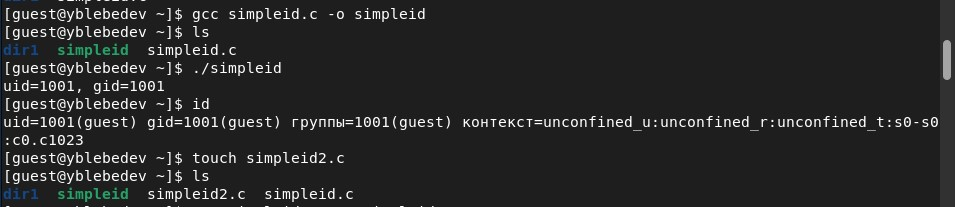
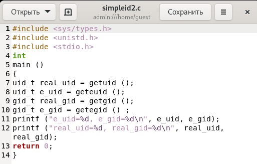
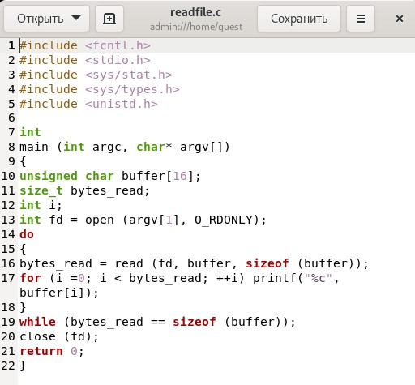
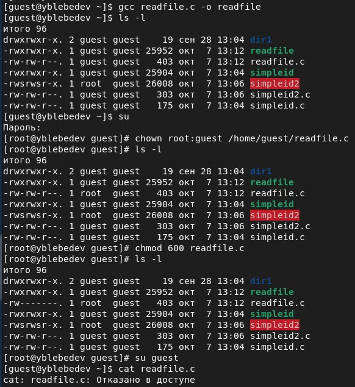
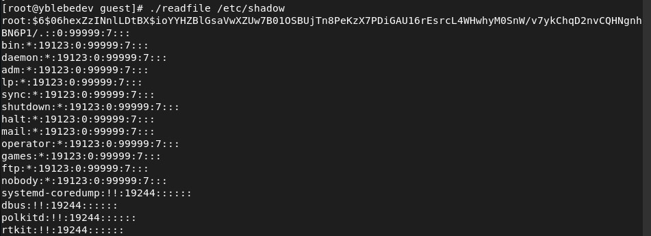
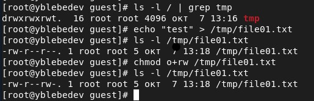
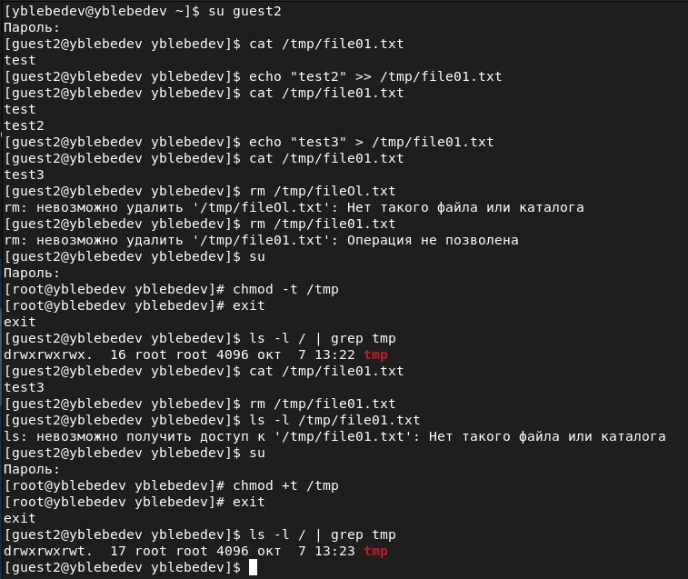

# Лабораторная работа № 5
## Дискреционное разграничение прав в Linux. Исследование влияния дополнительных атрибутов

выполнил: Лебедев Ярослав Борисович

группа:  НФИбд-02-19

РУДН, Москва

# Цель и задачи выполнения лабораторной работы:
Изучение механизмов изменения идентификаторов, применения
SetUID- и Sticky-битов. Получение практических навыков работы в консоли с дополнительными атрибутами. Рассмотрение работы механизма
смены идентификатора процессов пользователей, а также влияние бита
Sticky на запись и удаление файлов

# Результаты выполнения лабораторной работы

# Результаты выполнения лабораторной работы

# Результаты выполнения лабораторной работы

# Результаты выполнения лабораторной работы

# Результаты выполнения лабораторной работы

# Результаты выполнения лабораторной работы

# Результаты выполнения лабораторной работы

# Результаты выполнения лабораторной работы

# Выводы
Изучил механизмы изменения идентификаторов, применения
SetUID- и Sticky-битов. Получил практические навыки работы в консоли с дополнительными атрибутами. Рассмотрел работы механизма
смены идентификатора процессов пользователей, а также влияние бита
Sticky на запись и удаление файлов
